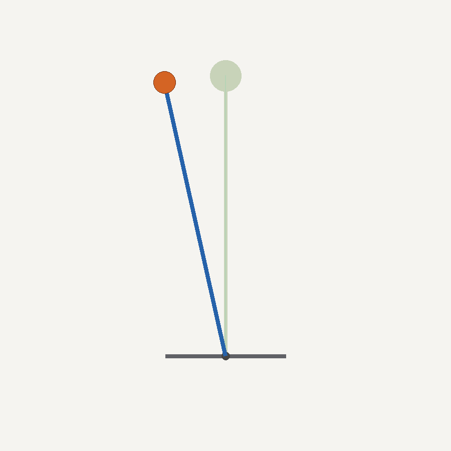
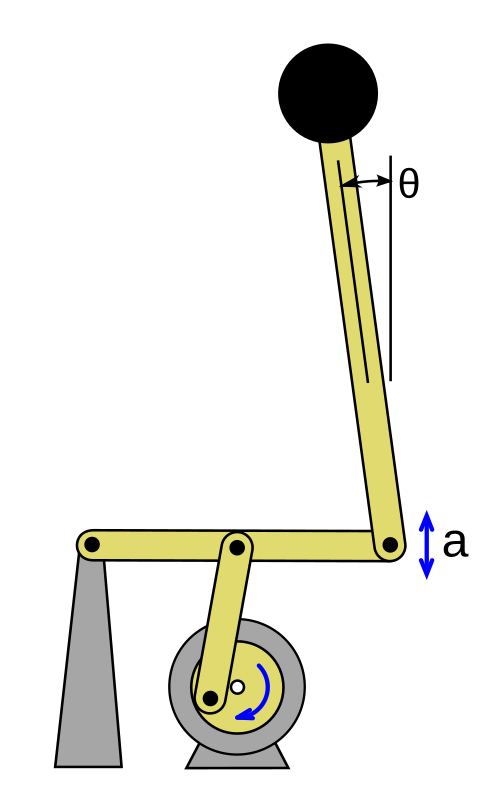
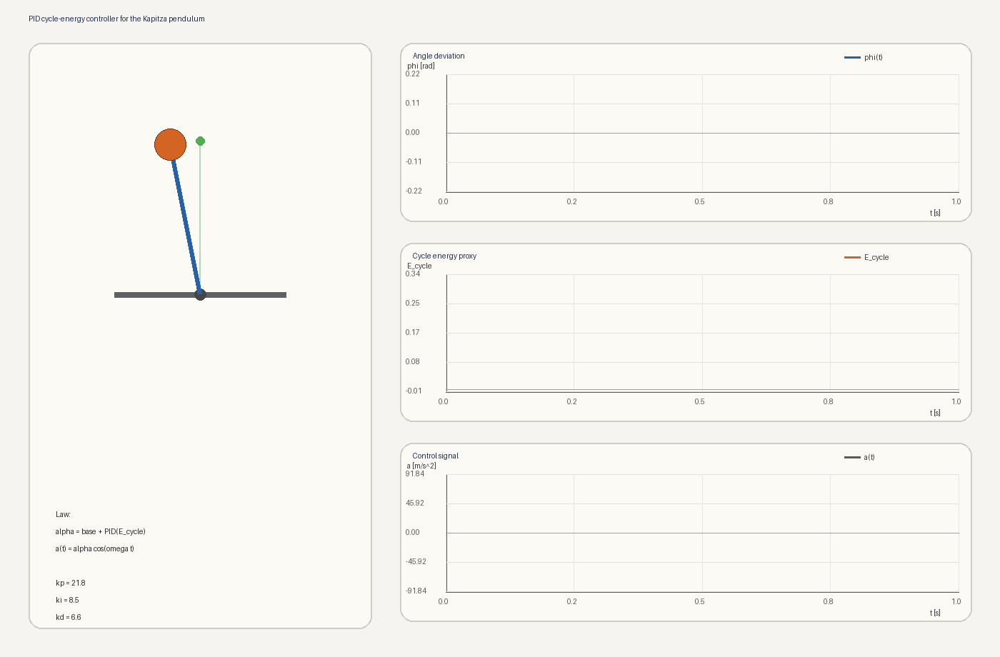
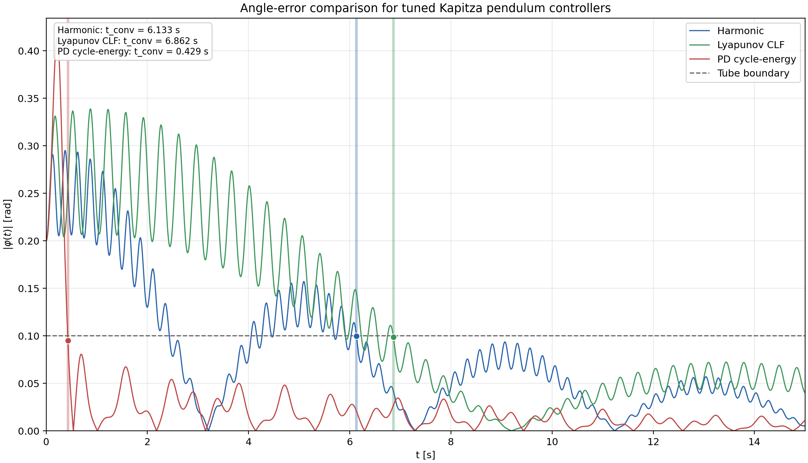
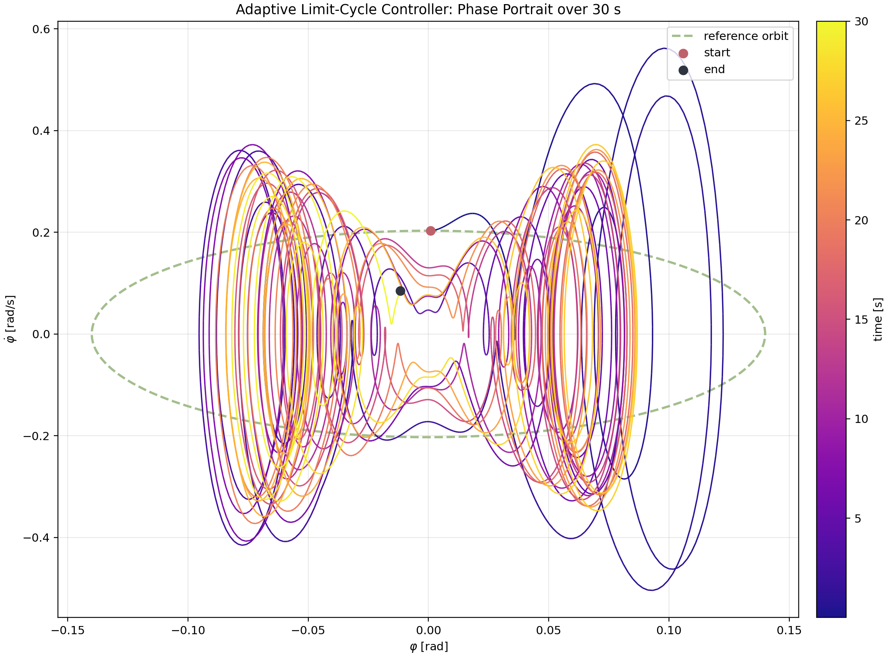
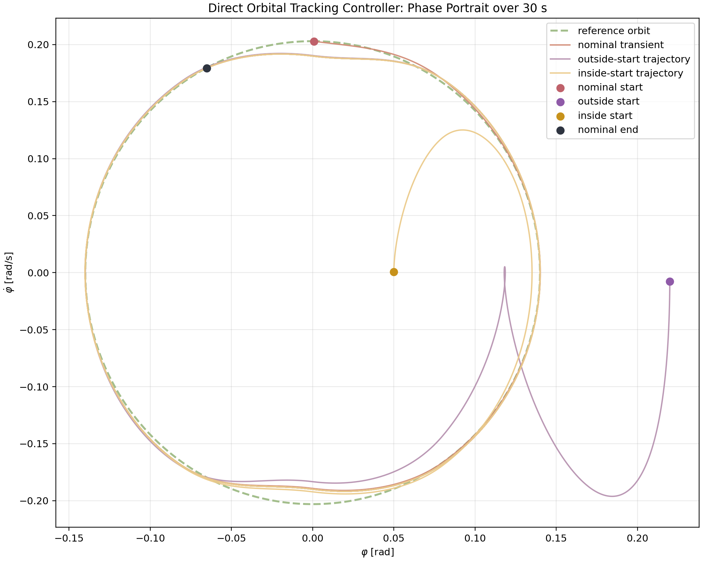

# Kapitza Pendulum Stabilization

This project studies stabilization of the Kapitza pendulum using Lyapunov-based methods.

<a href="animations/direct_orbit_tracking_outside_clean.gif">
  
</a>

## Problem Definition

The main goal of the project is to study how a Kapitza pendulum can be stabilized and controlled through vertical oscillations of the suspension point with Lyapunov-based design.

<a href="figures/Kapitza_pendulum.svg.png">
  
</a>


## Main Results

| Method | Physically admissible Kapitza control | Main task | Main outcome |
| --- | --- | --- | --- |
| Harmonic controller | Yes | Upright stabilization | Stabilizes the upright equilibrium, but with slower transients than feedback-based methods |
| Averaged-energy controller | Yes | Upright stabilization | Works reliably in the averaged regime, but remains slower than the best tuned feedback laws |
| PD cycle-energy controller | Yes | Upright stabilization | Fastest practical settling among the tuned physically admissible controllers |
| Lyapunov CLF controller | Yes | Upright stabilization | Cleanest analytical stability interpretation and strongest local decay behavior |
| Adaptive limit-cycle Lyapunov controller | Yes | Zero-mean orbital tracking | Did not achieve substantial orbit tracking; motion stayed near the upright equilibrium |
| Direct orbit-tracking benchmark | No | Trajectory tracking | Tracks the prescribed orbit well once the zero-mean restriction is removed |

## Notation

- `s` denotes the state
- `a` denotes the action, i.e. the control input
- `o` denotes the observation
- `t` denotes time
- `d` denotes viscous friction

In this project, the pendulum state is defined as

$$
\begin{aligned}
s &= \begin{bmatrix} s_1 \\ s_2 \\ s_3 \\ s_4 \end{bmatrix} \\
  &= \begin{bmatrix} h \\ \theta \\ \dot h \\ \dot\theta \end{bmatrix}.
\end{aligned}
$$

where

- $h$ is the vertical position of the suspension point
- $\theta$ is the pendulum angle measured as the deviation from the vertical upright direction
- $\dot h$ is the suspension velocity
- $\dot\theta$ is the angular velocity

The control input is chosen as the vertical acceleration of the suspension point:

$$
a = \ddot{h}.
$$

### Why we use acceleration as the control input

The Kapitza effect is governed by the suspension acceleration, so it is natural to use

$$
a=\ddot h
$$

as the control input. If the pivot motion is harmonic,

$$
\begin{aligned}
h(t) &= H\cos(\omega t), \\
\ddot h(t) &= -H\omega^2\cos(\omega t).
\end{aligned}
$$

then the acceleration amplitude is

$$
\alpha = H\omega^2.
$$

So changing the carrier frequency or displacement amplitude directly changes the quantity that enters the pendulum dynamics. Using `a` keeps the plant model compact and lets all controllers be written in a common form.

The simulation model also includes a viscous damping coefficient `d`.

For upright stabilization, the control objective is to drive the angular part of the state to the upright equilibrium:

$$
\begin{aligned}
s_2^\star &= 0, \\
s_4^\star &= 0, \\
(s_2,s_4) &\to (0,0).
\end{aligned}
$$

The suspension coordinates $(s_1,s_3)=(h,\dot h)$ are not fixed at zero in general, because they are generated by the chosen excitation law.

## Plant Model

We consider a pendulum of length `l` and bob mass `m`, whose suspension point moves only along the vertical axis according to `h = h(t)`.

Let $\theta$ be the pendulum angle measured from the upright vertical direction. Then the bob coordinates are

$$
\begin{aligned}
x &= l \sin \theta, \\
z &= h + l \cos \theta.
\end{aligned}
$$

Their velocities are

$$
\begin{aligned}
\dot{x} &= l \dot{\theta} \cos \theta, \\
\dot{z} &= \dot{h} - l \dot{\theta} \sin \theta.
\end{aligned}
$$

Hence, the squared speed is

$$
\begin{aligned}
v^2 &= \dot{x}^2 + \dot{z}^2 \\
    &= l^2 \dot{\theta}^2 + \dot{h}^2 - 2 l \dot{h} \dot{\theta} \sin \theta.
\end{aligned}
$$

The baseline model parameters used throughout the project are:

| Parameter | Symbol | Meaning | Default value |
| --- | --- | --- | --- |
| Gravity | `g` | gravitational acceleration | `9.81 m/s^2` |
| Pendulum length | `l` | rod length | `1.0 m` |
| Bob mass | `m` | point-mass bob | symbolic / cancels out of the equations of motion |
| Viscous damping | `d` | angular damping coefficient | `0.25` |
| Suspension position | `h(t)` | vertical pivot displacement | control-dependent |
| Suspension acceleration | `a(t)` | control input, `a = h_ddot` | control-dependent |

### Example GPT-5.4 prompt for building the simulation environment

The following prompt is sufficiently specific to reproduce a clean first version of the simulation environment used in this project:

```text
Create a Python simulation environment for a vertically actuated Kapitza pendulum. Use the state notation s \= \[s1, s2, s3, s4\]\^T \= \[h, theta, h\_dot, theta\_dot\]\^T, where h is the vertical suspension position and theta is the pendulum angle measured from the upright vertical direction. The control input must be a \= h\_ddot. Implement the nonlinear dynamics s1\_dot \= s3, s2\_dot \= s4, s3\_dot \= a, s4\_dot \= \(\(\(g \+ a\) / l\) \* sin\(s2\) \- d \* s4\). Use Python 3 with numpy and pygame. Create a small project structure with separate files for the plant model, controllers, simulation loop, and visualization. Add a main script that runs an interactive simulation. The visualization should draw the pendulum in the suspension-point frame, show the upright target, and allow switching between several controllers. Include at least: harmonic excitation a\(t\) \= A cos\(omega t\), one state-dependent amplitude controller a\(t\) \= alpha\(s\) cos\(omega t\), and one Lyapunov-inspired controller. Use a fixed simulation time step, configurable parameters \(g, l, d\), and an explicit resettable controller interface. Keep the code readable and ready for further experiments with stabilization and trajectory tracking.
```

## Lagrangian Derivation

The kinetic and potential energies are

$$
T = \frac{m}{2}\left( l^2 \dot{\theta}^2 + \dot{h}^2 - 2 l \dot{h} \dot{\theta} \sin \theta \right).
$$

$$
V = m g (h + l \cos \theta).
$$

Hence

$$
L = T - V.
$$

Applying Euler-Lagrange with respect to $\theta$,

$$
\frac{d}{dt}\frac{\partial L}{\partial \dot{\theta}} - \frac{\partial L}{\partial \theta} = 0,
$$

gives

$$
\begin{aligned}
\frac{\partial L}{\partial \dot{\theta}}
&= m l^2 \dot{\theta} - m l \dot{h} \sin \theta, \\
\frac{\partial L}{\partial \theta}
&= - m l \dot{h} \dot{\theta} \cos \theta + m g l \sin \theta.
\end{aligned}
$$

and

$$
\frac{d}{dt}\frac{\partial L}{\partial \dot{\theta}} = m l^2 \ddot{\theta} - m l \ddot{h} \sin \theta - m l \dot{h} \dot{\theta} \cos \theta.
$$

Substitution yields

$$
m l^2 \ddot{\theta} - m l \ddot{h} \sin \theta - m g l \sin \theta = 0.
$$

After dividing by `m l`,

$$
l \ddot{\theta} - (\ddot{h} + g)\sin\theta = 0,
$$

that is,

$$
\ddot{\theta} = \frac{g + \ddot{h}}{l} \sin \theta.
$$

With

$$
a = \ddot{h},
$$

the plant equation becomes

$$
\ddot{\theta} = \frac{g + a}{l}\sin\theta.
$$

## State-Space Form

With

$$
\begin{aligned}
s_1 &= h, \\
s_2 &= \theta, \\
s_3 &= \dot h, \\
s_4 &= \dot\theta.
\end{aligned}
$$

the system is written as

$$
\begin{aligned}
\dot{s}_1 &= s_3, \\
\dot{s}_2 &= s_4, \\
\dot{s}_3 &= a, \\
\dot{s}_4 &= \frac{g + a}{l}\sin s_2 - d s_4.
\end{aligned}
$$

In vector form,

$$
\dot{s} = p(s, a)
= \begin{bmatrix}
s_3 \\
s_4 \\
a \\
\dfrac{g + a}{l}\sin s_2 - d s_4
\end{bmatrix}.
$$

If the full state is measured, then

$$
\begin{aligned}
o &= s, \\
a &\leftarrow \pi(o).
\end{aligned}
$$

This is the baseline nonlinear model that will be used in the rest of the project. In the stability analysis below, the main focus is the angular subsystem $(s_2,s_4)=(\theta,\dot\theta)$, while $(s_1,s_3)=(h,\dot h)$ describe the suspension motion induced by the control.

## Development History

### Stage 1. Upright stabilization from the Kapitza equations

The first part of the project focused on the classical Kapitza mechanism: the pendulum is stabilized near the upright equilibrium through fast vertical oscillations of the suspension point. This stage established the nonlinear model, the averaged Kapitza model, the effective stiffness interpretation, and the first harmonic controller. 

#### Averaged Kapitza Model

Assume a harmonic suspension acceleration

$$
a(t)=\alpha\cos(\omega t).
$$

Then the nonlinear angular dynamics become

$$
\ddot{\theta} = \left(\frac{g}{l}+\frac{\alpha}{l}\cos(\omega t)\right)\sin\theta - d\dot{\theta}.
$$

For fast excitation, averaging gives the slow model

$$
\ddot{\theta}+d\dot{\theta}+U'(\theta)=0,
$$

with effective potential

$$
\begin{aligned}
U(\theta)
&= \frac{\alpha^2}{4l^2\omega^2}\sin^2\theta \\
&\quad + \frac{g}{l}(\cos\theta-1).
\end{aligned}
$$

Hence

$$
\begin{aligned}
\ddot{\theta}
&= -d\dot{\theta} \\
&\quad - \frac{\alpha^2}{2l^2\omega^2}\sin\theta\cos\theta \\
&\quad + \frac{g}{l}\sin\theta.
\end{aligned}
$$

Near the upright equilibrium, $\sin\theta\approx\theta$ and $\cos\theta\approx1$, so

$$
\begin{aligned}
\ddot{\theta}
&\approx -d\dot{\theta} \\
&\quad - \left(\frac{\alpha^2}{2l^2\omega^2}-\frac{g}{l}\right)\theta.
\end{aligned}
$$

Therefore the upright position is locally stabilized when

$$
\alpha^2 > 2gl\,\omega^2.
$$

Control input:

$$
a(t)=\ddot h(t).
$$

Controller law:

$$
\text{harmonic:}\qquad a(t)=A\cos(\omega t)
$$

All animations are drawn in the suspension-point frame to avoid visual vertical jittering.
[](animations/harmonic_stabilization_tuned.gif)


#### Main conclusion of this stage

- fast vertical oscillations are sufficient to stabilize the upright equilibrium
- the averaged model correctly predicts the existence of a stabilizing regime

### Stage 2. PD stabilization

The next step was to compare the physically admissible Kapitza-style controllers against simple PD baselines. A cycle-energy PD controller was implemented, acting through the carrier amplitude of the zero-mean excitation.

For the cycle-energy PD law, let

$$
e_k = E_{\mathrm{cycle},k}-E_\star
$$

denote the cycle-averaged energy error. In a local cycle-to-cycle approximation around the target regime, the next-cycle error depends smoothly on the amplitude correction:

$$
\begin{aligned}
e_{k+1} &\approx a e_k - b(\alpha_k-\alpha_\star), \\
a &\in(0,1),\; b>0.
\end{aligned}
$$

With the PD update

$$
\alpha_k=\alpha_\star + k_p e_k + k_d\frac{e_k-e_{k-1}}{T_c},
$$

the reduced error dynamics becomes

$$
\begin{aligned}
e_{k+1}
&= \left(a-bk_p-\frac{bk_d}{T_c}\right)e_k \\
&\quad + \frac{bk_d}{T_c}e_{k-1}.
\end{aligned}
$$

Therefore, the cycle-energy error converges locally to zero whenever the roots of the associated characteristic polynomial lie inside the unit disk. In that regime, the cycle energy approaches its target value, which implies local convergence of the oscillation envelope toward the upright tube.

Control input:

$$
a(t)=\alpha(t)\cos(\omega t).
$$

Controller law:

$$
\alpha_k=\alpha_\star + k_p e_k + k_d\frac{e_k-e_{k-1}}{T_c}
$$

[](animations/pid_cycle_energy_stabilization_tuned.gif)


#### Main conclusion of this stage

- PD feedback can stabilize the system effectively even under the zero-mean carrier structure
- among the physically admissible tuned controllers, the PD cycle-energy controller gave the shortest practical settling time

### Stage 3. Lyapunov-based stabilization

After the PD comparison, the project focused on Lyapunov-based stabilization. We derived controllers from the averaged dynamics and also used a direct Lyapunov benchmark on the exact nonlinear model.

#### Lyapunov Function for the Averaged Model

For the averaged dynamics, a natural Lyapunov candidate is the total effective energy

$$
\begin{aligned}
V(\theta, \dot{\theta})
&= \frac{1}{2}\dot{\theta}^2 + \frac{\alpha^2}{4 l^2 \omega^2}\sin^2\theta + \frac{g}{l}(\cos\theta - 1).
\end{aligned}
$$

This function satisfies

$$
V(0,0) = 0.
$$

Near the upright equilibrium, its quadratic approximation is

$$
\begin{aligned}
V(\theta, \dot{\theta})
&\approx \frac{1}{2}\dot{\theta}^2 + \frac{1}{2}\left(
\frac{\alpha^2}{2 l^2 \omega^2} - \frac{g}{l}
\right)\theta^2.
\end{aligned}
$$

Hence `V` is locally positive definite whenever

$$
\alpha^2 > 2 g l \omega^2.
$$

Differentiating `V` along the averaged dynamics gives

$$
\dot{V} = - d\dot{\theta}^2 \le 0.
$$

Therefore, under the Kapitza stabilization condition and in the presence of damping, the upright equilibrium is locally asymptotically stable for the averaged system.

#### Closed-Loop Target Dynamics and Control Lyapunov Function

For controller design, we do not need to stay with the open-loop averaged Kapitza energy only. Instead, we specify a desired local closed-loop averaged dynamics around the upright equilibrium:

$$
\ddot{\theta} + d\dot{\theta} + (k_0 + k_1 \theta^2)\theta = 0
$$

where

- `k_0 > 0` defines the local linear restoring stiffness
- `k_1 > 0` adds stronger restoring action for larger angular deviations

For this target dynamics, consider the polynomial Lyapunov function

$$
\begin{aligned}
V_{\mathrm{cl}}(\theta, \dot{\theta})
&= \frac{1}{2}\dot{\theta}^2 + \frac{1}{2}k_0 \theta^2 + \frac{1}{4}k_1 \theta^4.
\end{aligned}
$$

Its derivative along the target closed-loop dynamics is

$$
\begin{aligned}
\dot{V}_{\mathrm{cl}}
&= \dot{\theta}\left(
\ddot{\theta} + k_0 \theta + k_1 \theta^3
\right).
\end{aligned}
$$

Substituting

$$
\ddot{\theta} = - d\dot{\theta} - (k_0 + k_1 \theta^2)\theta
$$

gives

$$
\dot{V}_{\mathrm{cl}} = - d\dot{\theta}^2 \le 0.
$$

Therefore, `V_cl` is a valid local Lyapunov function for the chosen target closed-loop dynamics.

#### Amplitude Law from the Averaged Model

Near the upright equilibrium, the averaged Kapitza dynamics is approximated by

$$
\ddot{\theta} + d\dot{\theta} + k_{\mathrm{eff}}(\alpha)\theta \approx 0
$$

with

$$
k_{\mathrm{eff}}(\alpha) = \frac{\alpha^2}{2 l^2 \omega^2} - \frac{g}{l}.
$$

To match the target local stiffness

$$
k_{\mathrm{des}}(\theta) = k_0 + k_1 \theta^2,
$$

we choose the harmonic acceleration amplitude $\alpha(\theta)$ from

$$
\frac{\alpha(\theta)^2}{2 l^2 \omega^2} - \frac{g}{l} = k_0 + k_1 \theta^2.
$$

Hence,

$$
\alpha(\theta) = \sqrt{2 l^2 \omega^2 \left( \frac{g}{l} + k_0 + k_1 \theta^2 \right)}.
$$

The implemented Lyapunov controller then uses

$$
a(t) = \alpha(\theta)\cos(\omega t).
$$

This law is state-dependent through the angle $\theta$, so it is designed from a closed-loop target dynamics rather than from an open-loop averaged energy alone.

#### Interpretation of `k_eff`

The quantity

$$
k_{\mathrm{eff}} = \frac{\alpha^2}{2l^2\omega^2}-\frac{g}{l}.
$$

is the effective stiffness of the averaged Kapitza pendulum near the upright equilibrium. After averaging and linearization, the dynamics becomes

$$
\ddot{\theta}+d\dot{\theta}+k_{\mathrm{eff}}\theta=0
$$

so $k_{\mathrm{eff}}$ plays the role of the restoring coefficient: the vibration term $\alpha^2/(2l^2\omega^2)$ competes with the destabilizing gravity term $g/l$. Therefore, $k_{\mathrm{eff}}>0$ means local upright stabilization in the averaged model, which is equivalent to the Kapitza threshold

$$
\alpha^2 > 2gl\,\omega^2.
$$

#### Convergence Proof for the Current Lyapunov Controller

The Lyapunov controller is analyzed through the averaged closed-loop model generated by

$$
a(t)=\alpha(\theta)\cos(\omega t).
$$

The amplitude is chosen so that the effective stiffness matches

$$
k_{\mathrm{des}}(\theta)=k_0+k_1\theta^2,
$$

which yields the averaged dynamics

$$
\ddot{\theta}+d\dot{\theta}+(k_0+k_1\theta^2)\theta=0.
$$

In reduced coordinates,

$$
\begin{aligned}
\dot s_2 &= s_4, \\
\dot s_4 &= -d s_4-(k_0+k_1 s_2^2)s_2.
\end{aligned}
$$

Consider

$$
\begin{aligned}
V(s_2,s_4) &= \frac12 s_4^2+\frac12 k_0 s_2^2+\frac14 k_1 s_2^4, \\
\end{aligned}
$$
$$
\begin{aligned}
k_0 > 0 \; k_1 > 0.
\end{aligned}
$$

Then

$$
\dot V = -d s_4^2 \le 0.
$$

The set $\dot V=0$ implies $s_4=0$, and invariance then also requires

$$
\dot s_4=-(k_0+k_1 s_2^2)s_2=0,
$$

so the only invariant point is $(s_2,s_4)=(0,0)$. By LaSalle's principle, the averaged closed loop is asymptotically stable at the upright equilibrium.

For the original fast system, this gives local practical asymptotic stability through standard averaging arguments: when the carrier is sufficiently fast, the exact oscillatory dynamics remain close to the averaged one.

Control input used at this stage:

$$
a(t)=\alpha(\theta)\cos(\omega t)
$$

Controller law used at this stage:

$$
\frac{\alpha(\theta)^2}{2l^2\omega^2}-\frac{g}{l}=k_0+k_1\theta^2,
$$

For the tuned averaged Lyapunov controller shown below:

Control input:

$$
a(t)=\alpha(\theta)\cos(\omega t).
$$

Control law:

$$
\alpha(\theta) = \sqrt{2l^2\omega^2 \left( \frac{g}{l}+k_0+k_1\theta^2 \right)}
$$

[](animations/lyapunov_stabilization_tuned.gif)

#### Direct Lyapunov stabilization
If we relax the zero-mean Kapitza constraint and allow the suspension acceleration to be commanded directly, we can implement a direct Lyapunov controller on the exact nonlinear vertical-pivot model. In that case the system is no longer a classical Kapitza pendulum driven only by oscillatory excitation; it is better interpreted as a directly actuated pendulum with vertical pivot acceleration.

For the exact vertical model, a natural Lyapunov candidate is the mechanical energy around the upright equilibrium,

$$
V_{\mathrm{dir}}(\theta,\dot\theta) = \frac12 \dot\theta^2 + k_p(1-\cos\theta).
$$

It is obtained by combining the kinetic term with the upright potential-shaping term `1 - cos(theta)`, which is locally quadratic near $\theta=0$ and positive definite around the target equilibrium. Choosing the direct feedback law

$$
a=-g-lk_p-lk_c\dot\theta\sin\theta
$$

gives

$$
\dot V_{\mathrm{dir}}=-(d+k_c\sin^2\theta)\dot\theta^2 \le 0
$$

so the control injects a restoring term through `k_p` and adds state-dependent damping through `k_c`.


[](animations/direct_lyapunov_stabilization_tuned.gif)

#### Main conclusion of this stage

- the averaged Lyapunov controller gives the cleanest analytical stability interpretation
- PD controller provides superior settling time
- under the non-zero-mean assumption, the direct Lyapunov controller provides a smooth benchmark stabilization law on the exact model, but it is no longer a physically admissible Kapitza controller


#### Comparison of stabilization methods

The comparison plot shows that, among the physically admissible tuned controllers, the PD cycle-energy law reaches the angle tube first, while the Lyapunov CLF controller gives the cleanest and fastest local decay once the motion is already close to the upright equilibrium.

[](figures/tuned_controller_angle_error_comparison_15s.png)

From the graph:

- `PD cycle-energy` has the earliest final entry into the angle tube
- `Lyapunov CLF` is slightly slower in tube-entry time, but its decay is smoother and more structured
- `Harmonic` and `Averaged-energy` stabilize the pendulum as well, but with noticeably slower transients
- all four plotted controllers achieve practical stabilization around the upright position

The reason the PD controller converges faster is simple: it is less conservative. The PD cycle-energy controller reacts directly to the measured cycle energy and can change the carrier amplitude more aggressively. The Lyapunov controller, by contrast, is designed to enforce a desired averaged stiffness and preserve a clean Lyapunov structure, so it sacrifices some transient speed in exchange for a stronger analytical interpretation.


### Stage 4. Trajectory tracking with a Lyapunov function

We then extended the project from equilibrium stabilization to orbital control. The target was no longer a point but a prescribed oscillation around the upright position. This led to an energy-based Lyapunov function for orbital stabilization and to several tracking experiments.

At this stage, the reference motion is a target oscillation around the upright equilibrium,

$$
\theta_{\mathrm{ref}}(t)=A_\star\sin(\omega_\star t),
$$

where $A_\star$ is the target angular amplitude and $\omega_\star$ is the target oscillation frequency. The tracking error is written as $e=(e_1,e_2)$ with

$$
\begin{aligned}
e_1 &= \theta-\theta_{\mathrm{ref}}, \\
e_2 &= \dot\theta-\dot\theta_{\mathrm{ref}}.
\end{aligned}
$$

The scalar

$$
E=\frac12\dot\theta^2+\frac12\omega_\star^2\theta^2
$$

is the current oscillation energy in the shaped orbital coordinates, while

$$
E_\star=\frac12\omega_\star^2A_\star^2
$$

is the target energy corresponding to the desired orbit. The gain $k_d$ damps the velocity-tracking error, and $k_E$ penalizes the energy mismatch $E-E_\star$ so that the oscillation envelope is driven toward the desired amplitude.

Control input:

$$
a(t)=\alpha(s,t)\cos(\psi(t)),\qquad \dot\psi=\omega(s,t)
$$

Controller idea used at this stage:

$$
V(e,s)=\frac12 e_2^2+\frac12\omega_\star^2 e_1^2+\frac{\mu}{2}(E-E_\star)^2,
$$

with carrier parameters chosen so that the averaged dynamics approximates

$$
\ddot\theta = \ddot\theta_{\mathrm{ref}} - k_d e_2 - k_p e_1 - k_E(E-E_\star)\dot\theta
$$

[](animations/adaptive_limit_cycle_lyapunov_tracking.gif)
[](figures/adaptive_limit_cycle_phase_portrait_30s.png)

The phase portrait shows that, in the current zero-mean implementation, the motion remains trapped near the upright equilibrium instead of converging to the desired nontrivial orbit. This motivates the benchmark branch of the next stage, where the zero-mean restriction is relaxed.

#### Main conclusion of this stage

- Lyapunov ideas extend naturally from equilibrium stabilization to orbital stabilization
- with the zero-mean controllers implemented in this project, tracking of a substantial prescribed orbit was not achieved
- derived Lyapunov controller leads to practical stability around upright position as all previous controllers

### Stage 5. Neglected zero-mean control trajectory tracking

In the last major branch, we studied a benchmark setting in which gravity is effectively compensated and the pendulum is used as a directly actuated orbital system. In this regime, the pendulum can be driven around the pivot and nontrivial orbit-tracking behavior becomes much easier to analyze.

Control input:

$$
a=\pi(s,t),
$$

that is, direct state-feedback acceleration without the zero-mean Kapitza restriction.

The figures shown in this section correspond to the direct orbit-tracking benchmark only. In this case, the reference is a sinusoidal orbit around the upright equilibrium,

$$
\theta_{\mathrm{ref}}(t)=A_\star\sin(\omega_\star t),
$$

with the corresponding reference velocity and acceleration

$$
\dot\theta_{\mathrm{ref}}(t)=A_\star\omega_\star\cos(\omega_\star t),\qquad \ddot\theta_{\mathrm{ref}}(t)=-\omega_\star^2\theta_{\mathrm{ref}}(t)
$$

The tracking errors are defined as

$$
\begin{aligned}
e_1 &= \theta-\theta_{\mathrm{ref}}, \\
e_2 &= \dot\theta-\dot\theta_{\mathrm{ref}}.
\end{aligned}
$$

Besides pointwise tracking, we also shape the orbit in phase space through the orbital radius

$$
r=\sqrt{\theta^2+\left(\frac{\dot\theta}{\omega_\star}\right)^2},\qquad r_\star=A_\star
$$

This gives a benchmark Lyapunov candidate

$$
V_{\mathrm{trk}}=\frac12 e_2^2+\frac12\omega_\star^2 e_1^2+\frac12 k_o(r-r_\star)^2
$$

which combines velocity error, position error, and radial orbit error. The first two terms enforce tracking of the sinusoidal reference, while the last term pulls the trajectory back to the target closed curve in the phase plane.

and the direct feedback law is

$$
a = l\\frac{\ddot\theta_{\mathrm{ref}}-k_d e_2-k_p e_1-k_o(r-r_\star)\dot\theta+d\dot\theta}{\sin_\varepsilon\theta} - g
$$

where $k_p$ and $k_d$ are the usual position and rate gains, and $k_o$ controls attraction to the target orbit radius. The regularized denominator $\sin_\varepsilon\theta$ is used instead of $\sin\theta$ near zero to avoid singular behavior in the inversion of the nonlinear pendulum dynamics.

[](animations/direct_orbit_tracking_nominal.gif)
[](figures/direct_orbit_tracking_phase_portrait_30s.png)

#### Main conclusion of this stage

- once the strict zero-mean Kapitza restriction is removed, orbit tracking becomes possible
- limit-cycle is stable for both inner and outer starting points
- these results are useful as benchmark references, but they are not physically admissible Kapitza controllers


## Repository Structure

```text
+-- README.md
+-- README_horizontal_excitation.md
+-- requirements.txt
+-- configs/
¦   +-- default_simulation.txt
+-- animations/                  # Exported GIF animations
+-- figures/                     # Exported PNG/PDF comparison plots and phase portraits
+-- src/
¦   +-- main.py                  # Main entry point
¦   +-- simulation.py            # Numerical simulation loop
¦   +-- system.py                # Nonlinear pendulum plant
¦   +-- visualization.py         # Interactive pygame visualization
¦   +-- horizontal_excitation.py # Horizontal-excitation model branch
¦   +-- controllers/             # Harmonic, PD, Lyapunov, and benchmark controllers
+-- generate_*.py                # Standalone scripts for figures and GIFs
+-- .venv/                       # Local virtual environment
```

## Reproducibility

Create a virtual environment inside the project folder and install the required dependencies:

```powershell
python -m venv .venv
.venv\Scripts\Activate.ps1
python -m pip install -r requirements.txt
```

Run the simulation with:

```powershell
python src/main.py
```

## Current Controllers

The simulator currently includes six controller modes:

1. Harmonic controller:

$$
a(t) = A \cos(\omega t + \psi_0),
$$

with interactive amplitude `A` and frequency $\omega$. For the default parameters, the averaged stabilization threshold is

$$
A > \sqrt{2 g l}\,\omega \approx 112.1 \text{ m/s}^2,\qquad \omega = 25.3 \text{ rad/s}
$$

The default choice is

$$
A = 116.5 \text{ m/s}^2,\qquad \omega = 25.3 \text{ rad/s}
$$

2. Averaged-energy controller:

This controller uses a high-frequency carrier with state-dependent amplitude:

$$
a(t) = \alpha(s)\cos(\omega t),
$$

where $\alpha(s)$ increases when the angular state moves farther from the upright equilibrium.

3. Lyapunov controller:

This controller chooses the carrier amplitude from the desired stiffness law

$$
a(t)=\alpha(\theta)\cos(\omega t),\qquad k_{\mathrm{des}}(\theta)=k_0+k_1\theta^2
$$

In the current default implementation, `k_0 = 0.35` and `k_1 = 2.35`.

4. Limit-cycle Lyapunov controller:

This controller targets a nonzero periodic orbit around the upright equilibrium using a carrier with state-dependent amplitude:

$$
a(t)=\alpha(t)\cos(\psi(t)),\qquad \dot\psi=\omega_c
$$

Its objective is not point stabilization but orbital tracking toward a prescribed oscillation with target amplitude `A*` and frequency `w*`.

5. PD position controller:

This controller applies PD feedback to the angle magnitude and uses it to modulate the carrier amplitude:

$$
\alpha(t)=\alpha_0 + k_p|\theta(t)| + k_d\frac{d}{dt}|\theta(t)|,\qquad a(t)=\alpha(t)\cos(\omega t)
$$

It is the simplest feedback baseline in the project.

6. PD cycle-energy controller:

This controller updates the amplitude once per carrier cycle using an energy proxy:

$$
\begin{aligned}
\alpha_{k+1}
&= \alpha_0 \\
&\quad + k_p E_{\mathrm{cycle},k} \\
&\quad + k_d\frac{E_{\mathrm{cycle},k}-E_{\mathrm{cycle},k-1}}{T_c}, \\
a(t) &= \alpha(t)\cos(\omega t).
\end{aligned}
$$

It is less instantaneous than PD-on-angle and acts on cycle-averaged behavior.

## Direct Benchmark Controller

For completeness, the repository also includes a direct Lyapunov benchmark controller that acts on the exact nonlinear model without averaging:

$$
V_{\mathrm{dir}}(\theta,\dot{\theta})=\frac{1}{2}\dot{\theta}^2 + k_p (1-\cos\theta)
$$

For the exact plant

$$
\ddot{\theta} = \frac{g+a}{l}\sin\theta - d\dot{\theta}.
$$

the control law

$$
a = -g - l k_p - l k_c \dot{\theta}\sin\theta
$$

gives

$$
\dot V_{\mathrm{dir}} = -\left(d + k_c \sin^2\theta\right)\dot{\theta}^2 \le 0.
$$

So this controller is Lyapunov-based on the exact vertical dynamics, rather than on the averaged Kapitza approximation.

## Pygame Controls

- `1` selects the harmonic controller
- `2` selects the averaged-energy controller
- `3` selects the Lyapunov controller
- `4` selects the limit-cycle Lyapunov controller
- `5` selects the PD position controller
- `6` selects the PD cycle-energy controller
- `Up` and `Down` increase or decrease the harmonic amplitude
- `Left` and `Right` increase or decrease the harmonic frequency
- `Z` and `C` select `kp` and `kd` for PD tuning
- `X` reminds that there is no integral term in the PD controllers
- `J` and `K` decrease or increase the selected PD gain
- `Space` pauses or resumes the simulation
- `R` resets the simulation
- `Esc` closes the application

## GIF Generators

The repository contains standalone scripts that generate GIF animations for the main controller variants:

- `python generate_frequency_ramp_gif.py`
- `python generate_harmonic_gif.py`
- `python generate_averaged_energy_gif.py`
- `python generate_lyapunov_gif.py`
- `python generate_direct_lyapunov_gif.py`
- `python generate_pid_position_gif.py`
- `python generate_pid_cycle_energy_gif.py`

## References

- P. L. Kapitza, "Dynamic stability of a pendulum when its point of suspension vibrates," in *Collected Papers of P. L. Kapitza*, Pergamon Press, 1965.
- H. K. Khalil, *Nonlinear Systems*, 3rd ed., Prentice Hall, 2002.
- J.-J. E. Slotine and W. Li, *Applied Nonlinear Control*, Prentice Hall, 1991.
- J. A. Sanders, F. Verhulst, and J. Murdock, *Averaging Methods in Nonlinear Dynamical Systems*, 2nd ed., Springer, 2007.

## Future Work

- Improve zero-mean orbital tracking under the physical Kapitza actuation constraint.
- Add actuator dynamics, saturation, and measurement noise.
- Study output-feedback and observer-based control.
- Extend the horizontal-excitation branch with the same level of analysis as the vertical case.
