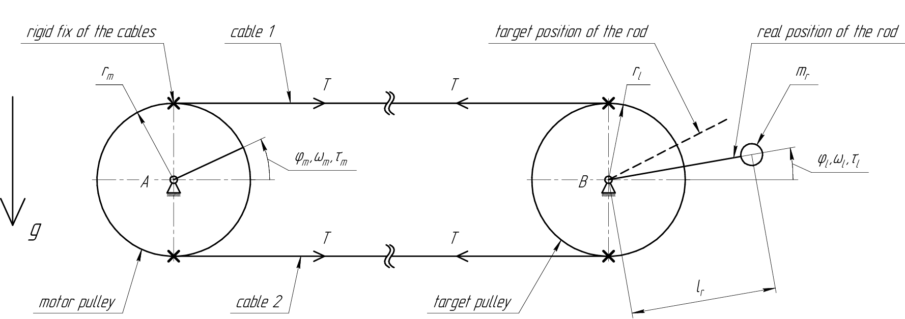
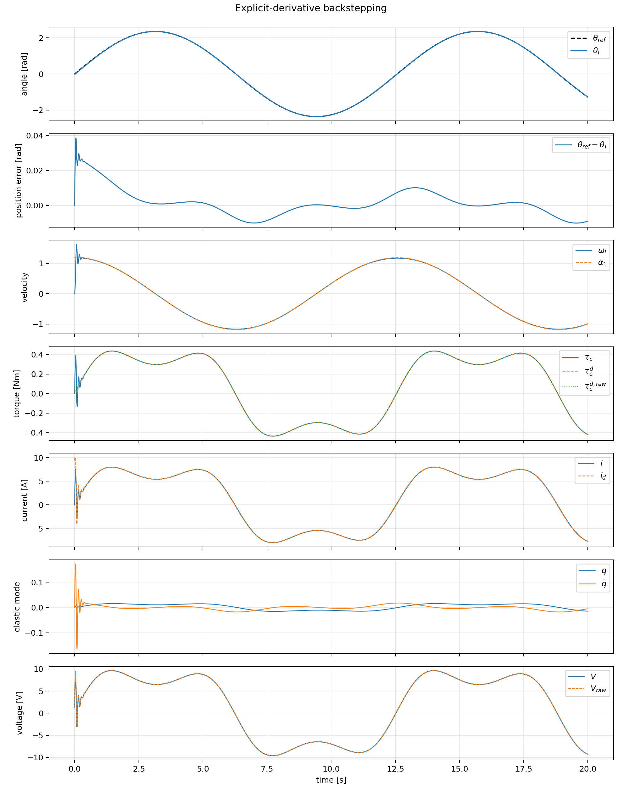
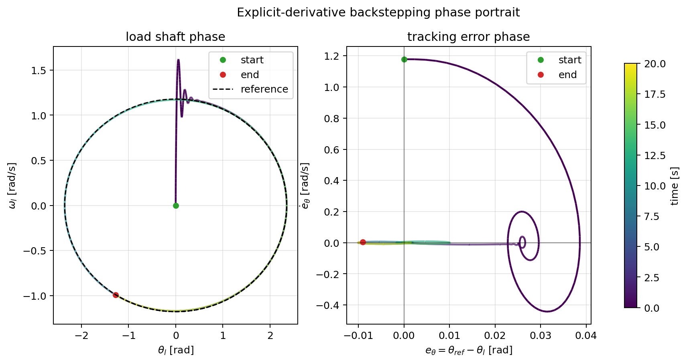
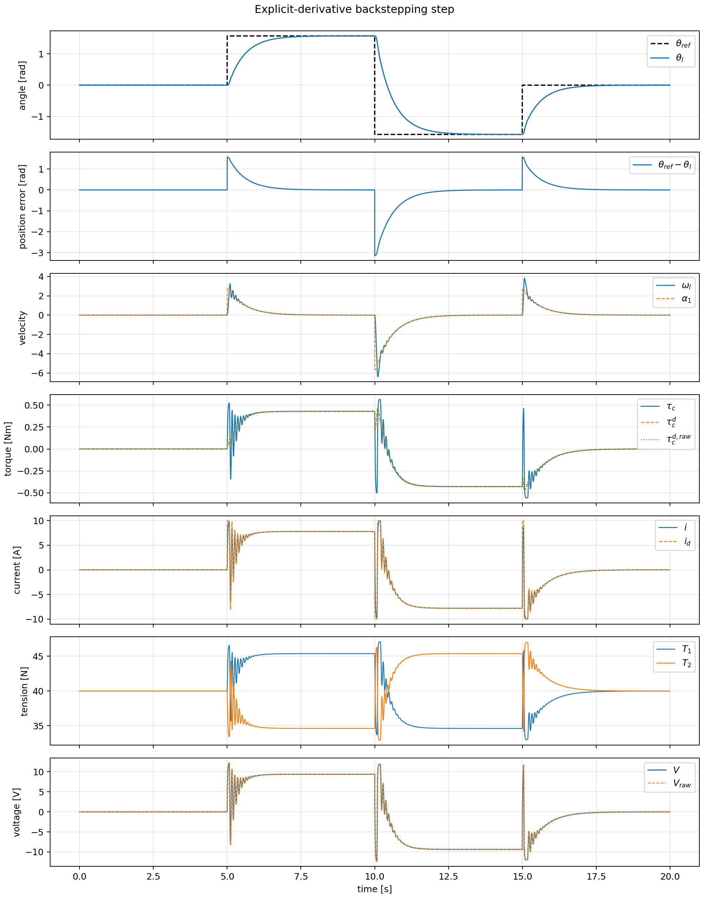
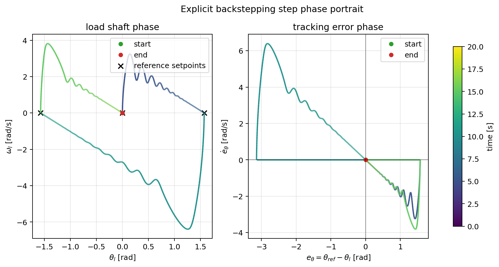
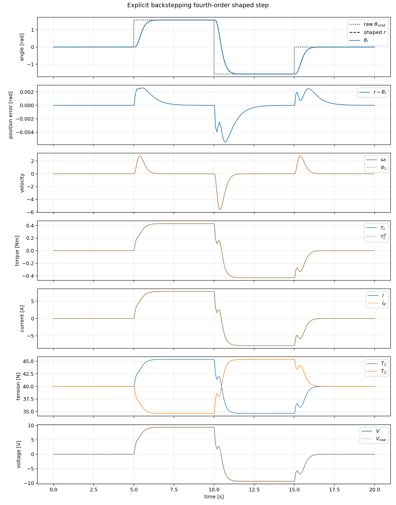
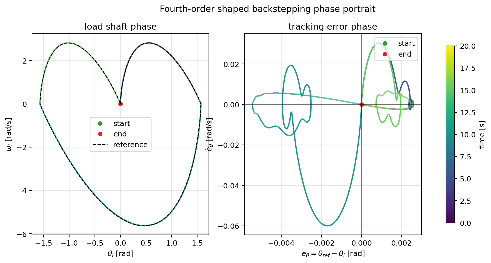

# Cable-Driven Pulley Position Control with Backstepping

## 1. Problem Definition


The project studies position control of a target pulley with an attached asymmetric rod load. The target pulley is driven through two highly elastic pre-tensioned cables by a DC motor pulley. The real control input is motor voltage, while the controlled output is the target/load shaft angle.

The main control objective is

```math
\phi_l(t)\rightarrow \phi_{\mathrm{ref}}(t)
```

under cable elasticity, cable damping, rod gravity torque, motor electrical dynamics, and voltage saturation.

Two controller families are evaluated:

- manually tuned PID control;
- model-based backstepping control.

The key practical issue is cable vibration. The final simulations show that the raw step command excites the elastic mode strongly; a smooth fourth-order reference shaper makes the same backstepping controller track a shaped step with small tracking error and much lower voltage-rate demand.

## 2. Main Results

The main numerical results are:

| Case | Controller | Gains | RMS position error, rad | Tail RMS error, rad | Max error, rad | RMS voltage, V | RMS voltage rate, V/s | Min cable tension, N |
| --- | --- | --- | ---: | ---: | ---: | ---: | ---: | ---: |
| Sine | PID | $K_p=60$, $K_i=1$, $K_d=3$ | 0.1219 | 0.1214 | 0.1687 | 7.4076 | 9.1813 | 34.5505 |
| Step | PID | $K_p=17$, $K_i=10$, $K_d=2.5$ | 0.3699 | 0.4135 | 3.1171 | 6.8696 | 248.4642 | 26.9816 |
| Sine | Backstepping | $k_1=0.9$, $k_2=1.75$, $k_3=3$, $k_4=50$ | 0.0078 | 0.0053 | 0.0386 | 7.3186 | 19.5199 | 34.5525 |
| Raw step | Backstepping | $k_1=1.8$, $k_2=3.5$, $k_3=6$, $k_4=100$ | 0.4775 | 0.5339 | 3.1414 | 6.4866 | 83.2297 | 32.9359 |
| Fourth-order shaped step | Backstepping | $k_1=1.8$, $k_2=3.5$, $k_3=6$, $k_4=100$ | 0.0013 | 0.0015 | 0.0054 | 6.3449 | 7.3197 | 34.6352 |

For the sine reference, explicit-derivative backstepping is much more accurate than PID without increasing voltage magnitude. For raw step commands, neither controller receives a smooth reference, and the discontinuity excites the elastic cable dynamics. The fourth-order shaped step removes this practical mismatch and gives the best backstepping result in the current project.

## 3. Notation

| Symbol | Meaning | Unit |
| --- | --- | --- |
| $\phi_l$ | target/load shaft angle | rad |
| $\omega_l$ | target/load shaft angular velocity | rad/s |
| $\phi_m$ | motor pulley angle | rad |
| $\omega_m$ | motor pulley angular velocity | rad/s |
| $i$ | motor current | A |
| $V$ | motor voltage | V |
| $q$ | cable deformation | m |
| $\dot q$ | cable deformation rate | m/s |
| $T_1,T_2$ | cable tensions | N |
| $\tau_c$ | cable torque on target shaft | N m |
| $\tau_g$ | rod gravity torque | N m |
| $J_l$ | total target-side inertia | kg m<sup>2</sup> |
| $J_m$ | total motor-side inertia | kg m<sup>2</sup> |
| $R$ | motor resistance | Ohm |
| $L_e$ | motor inductance | H |
| $K_t$ | motor torque constant | N m/A |
| $K_e$ | back-EMF constant | V s/rad |

The state vector is

```math
s =
\begin{bmatrix}
\phi_l &
\omega_l &
\phi_m &
\omega_m &
i
\end{bmatrix}^T
```

and the action is

```math
a=V
```

## 4. Mathematical Model



The numerical model is configured in [configs/default.json](configs/default.json). The main parameters are:

| Symbol | Parameter | Value | Unit |
| --- | --- | ---: | --- |
| $J_{p,l}$ | target pulley inertia | 0.00012 | kg m<sup>2</sup> |
| $J_{p,m}$ | motor pulley inertia | 0.00008 | kg m<sup>2</sup> |
| $J_r$ | motor rotor inertia | 0.00018 | kg m<sup>2</sup> |
| $r_l$ | target pulley radius | 0.04 | m |
| $r_m$ | motor pulley radius | 0.04 | m |
| $k$ | cable stiffness | 350.0 | N/m |
| $c$ | cable damping | 18.0 | N s/m |
| $T_0$ | cable pre-tension | 40.0 | N |
| $b_l$ | target viscous damping | 0.012 | N m s/rad |
| $b_m$ | motor viscous damping | 0.004 | N m s/rad |
| $m_r$ | rod mass | 0.25 | kg |
| $L_r$ | rod length | 0.35 | m |
| $R$ | motor resistance | 1.2 | Ohm |
| $L_e$ | motor inductance | 0.0025 | H |
| $K_t$ | torque constant | 0.055 | N m/A |
| $K_e$ | back-EMF constant | 0.055 | V s/rad |
| $V_{\max}$ | voltage limit | 24.0 | V |

The cable deformation is

```math
q=r_m\phi_m-r_l\phi_l
```

and the cable deformation rate is

```math
\dot q=r_m\omega_m-r_l\omega_l
```

The cables are modeled as pre-tensioned Kelvin-Voigt elements:

```math
F_{\mathrm{KV}}=kx+c\dot x
```

where $k$ is cable stiffness and $c$ is viscous damping. The pre-tension prevents negative cable tension in the operating range, while the torque-producing tension difference is

```math
T_1-T_2=2(kq+c\dot q)
```

The cable torque on the target shaft is

```math
\tau_c=r_l(T_1-T_2)=2r_l(kq+c\dot q)
```

The final plant equations are:

```math
\dot\phi_l=\omega_l
```

```math
\dot\omega_l=
\frac{\tau_c+\tau_g(\phi_l)-b_l\omega_l-\tau_0}{J_l}
```

```math
\dot\phi_m=\omega_m
```

```math
\dot\omega_m=
\frac{K_ti-\frac{r_m}{r_l}\tau_c-b_m\omega_m}{J_m}
```

```math
\dot i=
\frac{V-Ri-K_e\omega_m}{L_e}
```

with

```math
\tau_g(\phi_l)=-m_rg\frac{L_r}{2}\sin\phi_l
```

and

```math
J_l=J_{p,l}+\frac{1}{3}m_rL_r^2,
\qquad
J_m=J_{p,m}+J_r
```

## 5. PID Control Evaluation

The PID controller is used as the baseline. It acts on target angle error and outputs motor voltage:

```math
V=K_pe+K_i\int e\,dt+K_d\dot e
```

The final manual tuning values are:

| Reference | $K_p$ | $K_i$ | $K_d$ |
| --- | ---: | ---: | ---: |
| Sine | 60.0 | 1.0 | 3.0 |
| Step | 17.0 | 10.0 | 2.5 |

The sine PID response is acceptable but it has phase lag with underpowered motor:


The corresponding sine PID phase portrait is:


The sine PID animation is:


The step PID response hits the voltage limit briefly and excites stronger cable motion; the integral coefficient is high to decrease static error, which damps the transition:


The corresponding step PID phase portrait is:


The step PID animation is:


PID control provides reasonable accuracy with neglecting the internal dynamics.

## 6. Backstepping Controller Derivation

### Notation

The state is

```math
s =
\begin{bmatrix}
\phi_l \\
\omega_l \\
\phi_m \\
\omega_m \\
i
\end{bmatrix}
```

where:

- $\phi_l$ is the target/load shaft angle;
- $\omega_l$ is the target/load shaft angular velocity;
- $\phi_m$ is the motor pulley angle;
- $\omega_m$ is the motor pulley angular velocity;
- $i$ is the motor current.

The action is

```math
a = V,
```

the motor voltage.

The tracking objective is

```math
\phi_l(t) \to \phi_{\mathrm{ref}}(t)
```

For this project we fix a smooth sinusoidal reference:

```math
\phi_{\mathrm{ref}}(t) = A\sin(\omega_r t),
```

with

```math
A = \frac{3\pi}{4}
```

Therefore:

```math
\dot{\phi}_{\mathrm{ref}}(t)
=
A\omega_r\cos(\omega_r t),
```

```math
\ddot{\phi}_{\mathrm{ref}}(t)
=
-A\omega_r^2\sin(\omega_r t)
```

The explicit-derivative implementation also uses:

```math
\phi_{\mathrm{ref}}^{(3)}(t)
=
-A\omega_r^3\cos(\omega_r t),
```

```math
\phi_{\mathrm{ref}}^{(4)}(t)
=
A\omega_r^4\sin(\omega_r t)
```

### Plant Model

The derived inertias are:

| Symbol | Definition | Value | Unit |
| --- | --- | ---: | --- |
| $J_{\mathrm{rod}}$ | $m_r L_r^2 / 3$ | 0.0102083 | kg m<sup>2</sup> |
| $J_l$ | $J_{p,l}+J_{\mathrm{rod}}$ | 0.0103283 | kg m<sup>2</sup> |
| $J_m$ | $J_{p,m}+J_r$ | 0.00026 | kg m<sup>2</sup> |

Cable deformation:

```math
q = r_m\phi_m-r_l\phi_l
```

Cable deformation rate:

```math
\dot q = r_m\omega_m-r_l\omega_l
```

The two cables are modeled as pre-tensioned Kelvin-Voigt elements. In this
model each cable behaves like a linear spring and viscous damper connected in
parallel: the elastic part produces force proportional to cable deformation,
and the damping part produces force proportional to deformation rate. The
generic Kelvin-Voigt force law is

```math
F_{\mathrm{KV}} = kx+c\dot x,
```

where $k$ is the cable stiffness and $c$ is the viscous damping coefficient. 

To avoid cases when cables have negative tension and stop behaving like springs we introduce initial pre-tension. The
pre-tension cancels from the torque balance, while the tension difference is

```math
T_1-T_2=2(kq+c\dot q)
```

The cable torque acting on the target shaft is

```math
\tau_c = r_l(T_1-T_2)
=2r_l(kq+c\dot q)
```

The asymmetric rod load is rigidly attached to the target shaft. Its inertia is

```math
J_{\mathrm{rod}}=\frac{1}{3}m_rL_r^2,
```

so the total target inertia is

```math
J_l = J_{\mathrm{pulley},l}+J_{\mathrm{rod}}
```

The rod gravity torque is

```math
\tau_g(\phi_l)
=
-m_rg\frac{L_r}{2}\sin\phi_l
```

The target shaft dynamics are

```math
J_l\dot\omega_l
=
\tau_c+\tau_g(\phi_l)-b_l\omega_l-\tau_0
```

The motor-side dynamics are

```math
J_m\dot\omega_m
=
K_t i-r_m(T_1-T_2)-b_m\omega_m
```

Since

```math
r_m(T_1-T_2)=\frac{r_m}{r_l}\tau_c,
```

we can write

```math
J_m\dot\omega_m
=
K_t i-\frac{r_m}{r_l}\tau_c-b_m\omega_m
```

The DC motor electrical dynamics are

```math
L_e\dot i = V-Ri-K_e\omega_m
```

The final state-space plant model is therefore:

```math
\dot\phi_l=\omega_l,
```

```math
\dot\omega_l
=
\frac{
\tau_c+\tau_g(\phi_l)-b_l\omega_l-\tau_0
}{J_l},
```

```math
\dot\phi_m=\omega_m,
```

```math
\dot\omega_m
=
\frac{
K_ti-\frac{r_m}{r_l}\tau_c-b_m\omega_m
}{J_m},
```

```math
\dot i
=
\frac{
V-Ri-K_e\omega_m
}{L_e}
```

with

```math
q=r_m\phi_m-r_l\phi_l,
\qquad
\dot q=r_m\omega_m-r_l\omega_l,
```

```math
\tau_c=2r_l(kq+c\dot q),
\qquad
\tau_g(\phi_l)=-m_rg\frac{L_r}{2}\sin\phi_l
```

### Backstepping Controller Equation Derivation

The implemented chain is:

```math
\phi_l
\rightarrow
\alpha_1=\omega_l^d
\rightarrow
\tau_c^d
\rightarrow
i_d
\rightarrow
V
```

The derivation below follows this path step by step. We cannot command the
load angle directly; the real plant input is the motor voltage. Therefore the
backstepping construction first treats the load velocity $\omega_l$ as a
virtual input and designs the desired velocity $\alpha_1$. Then the load-side
mechanical equation is used to find the desired cable torque $\tau_c^d$ that
would produce that velocity behavior. The cable and motor mechanical dynamics
then convert the desired cable-torque behavior into a desired motor current
$i_d$. Finally, the motor electrical equation is used to choose the actual
voltage $V$ that makes the current track $i_d$.

### Step 1. Position Error and Virtual Velocity

Define the position tracking error:

```math
z_1 = \phi_l-\phi_{\mathrm{ref}}
```

Start with the Lyapunov function

```math
L_1 = \frac{1}{2}z_1^2
```

Its derivative is

```math
\dot L_1 = z_1\dot z_1,
```

where

```math
\dot z_1 = \omega_l-\dot\phi_{\mathrm{ref}}
```

Treat $\omega_l$ as the first virtual input and choose the desired target-shaft
velocity

```math
\alpha_1
=
\dot\phi_{\mathrm{ref}}-k_1z_1
```

Define

```math
z_2=\omega_l-\alpha_1
```

Then

```math
\dot z_1=-k_1z_1+z_2
```

If $z_2=0$, the position error decays exponentially.

### Step 2. Desired Cable Torque

Augment the Lyapunov function:

```math
L_2=L_1+\frac{1}{2}z_2^2
```

The derivative of $z_2$ is

```math
\dot z_2
=
\dot\omega_l-\dot\alpha_1
```

Using the target dynamics:

```math
\dot z_2
=
\frac{1}{J_l}
\left(
\tau_c+\tau_g-b_l\omega_l-\tau_0
\right)
-\dot\alpha_1
```

Treat $\tau_c$ as the next virtual input. Choose the desired cable torque:

```math
\tau_c^d
=
J_l
\left(
\dot\alpha_1-z_1-k_2z_2
\right)
-\tau_g
+b_l\omega_l
+\tau_0
```

If $\tau_c = \tau_c^d$, then

```math
\dot z_2=-z_1-k_2z_2,
```

and

```math
\dot L_2=-k_1z_1^2-k_2z_2^2
```

Because the cable torque is not directly commanded, define the torque error

```math
z_3=\tau_c-\tau_c^d
```

Then

```math
\dot z_2=-z_1-k_2z_2+\frac{z_3}{J_l}
```

### Step 3. Desired Motor Current

Augment again:

```math
L_3=L_2+\frac{1}{2}z_3^2
```

The cable torque is

```math
\tau_c=2r_l(kq+c\dot q)
```

Therefore

```math
\dot\tau_c
=
2r_l(k\dot q+c\ddot q)
```

Since

```math
\dot q=r_m\omega_m-r_l\omega_l,
```

we have

```math
\ddot q=r_m\dot\omega_m-r_l\dot\omega_l
```

After substituting the pulley dynamics, the torque dynamics can be written in
control-affine form with respect to motor current:

```math
\dot\tau_c=F_c(s)+G_ci,
```

where

```math
F_c(s)
=
2r_l
\left[
k\dot q
+c
\left(
r_m
\frac{
-\frac{r_m}{r_l}\tau_c-b_m\omega_m
}{J_m}
-r_l
\frac{
\tau_c+\tau_g-b_l\omega_l-\tau_0
}{J_l}
\right)
\right],
```

and

```math
G_c=\frac{2r_lcr_mK_t}{J_m}
```

This term is nonzero when cable damping $c>0$. This is useful: the current
appears in the first derivative of cable torque.

The torque error dynamics are

```math
\dot z_3
=
\dot\tau_c-\dot\tau_c^d
=
F_c(s)+G_ci-\dot\tau_c^d
```

Now we can put the whole thing into the same bracket:

```math
\dot L_3
=
-k_1z_1^2
-k_2z_2^2
+z_3
\left[
\frac{z_2}{J_l}
+F_c(s)
+G_ci
-\dot\tau_c^d
\right]
```

The bracket contains:

- the coupling from the previous step, $z_2/J_l$;
- all known nonlinearities and passive plant terms, $F_c(s)$;
- the new virtual input channel, $G_ci$;
- the derivative of the desired virtual torque, $\dot\tau_c^d$.

Choose the desired current so that this entire bracket becomes $-k_3 z_3$:

```math
i_d
=
\frac{1}{G_c}
\left(
-F_c(s)
+\dot\tau_c^d
-\frac{z_2}{J_l}
-k_3z_3
\right)
```

If $i = i_d$, then

```math
\frac{z_2}{J_l}
+F_c(s)
+G_ci_d
-\dot\tau_c^d
=
-k_3z_3,
```

and therefore

```math
\dot L_3
=
-k_1z_1^2
-k_2z_2^2
-k_3z_3^2
```

Define the current tracking error:

```math
z_4=i-i_d
```

When $i$ is not yet equal to $i_d$, the same substitution gives

```math
\dot L_3
=
-k_1z_1^2
-k_2z_2^2
-k_3z_3^2
+G_cz_3z_4
```

That remaining cross term is what the voltage step must cancel.

### Step 4. Real Motor Voltage

Use the final Lyapunov function:

```math
L_4
=
\frac{1}{2}z_1^2
+\frac{1}{2}z_2^2
+\frac{1}{2}z_3^2
+\frac{1}{2}z_4^2
```

The current dynamics are

```math
\dot i
=
\frac{1}{L_e}
\left(
V-Ri-K_e\omega_m
\right)
```

The current error dynamics are

```math
\dot z_4=\dot i-\dot i_d
```

Substitute this into the Lyapunov derivative:

```math
\dot L_4
=
-k_1z_1^2
-k_2z_2^2
-k_3z_3^2
+z_4
\left[
G_cz_3
+\frac{1}{L_e}
\left(
V-Ri-K_e\omega_m
\right)
-\dot i_d
\right]
```

Choose the real motor voltage so that the whole bracket becomes $-k_4z_4$:

```math
V
=
Ri
+K_e\omega_m
+L_e
\left(
\dot i_d
-G_cz_3
-k_4z_4
\right)
```

Then

```math
\dot z_4=-G_cz_3-k_4z_4
```

Substituting all error dynamics gives

```math
\dot L_4
=
-k_1z_1^2
-k_2z_2^2
-k_3z_3^2
-k_4z_4^2
\le 0
```

This proves Lyapunov stability for the ideal model without saturation and with
exact derivatives.

### Final Controller Equations

Collecting the four backstepping steps, the implemented controller is:

```math
z_1=\phi_l-\phi_{\mathrm{ref}},
```

```math
\alpha_1=\dot\phi_{\mathrm{ref}}-k_1z_1,
\qquad
z_2=\omega_l-\alpha_1,
```

```math
\tau_c^d
=
J_l
\left(
\dot\alpha_1-z_1-k_2z_2
\right)
-\tau_g(\phi_l)
+b_l\omega_l
+\tau_0,
```

```math
z_3=\tau_c-\tau_c^d,
```

```math
i_d
=
\frac{1}{G_c}
\left(
-F_c(s)
+\dot\tau_c^d
-\frac{z_2}{J_l}
-k_3z_3
\right),
```

```math
z_4=i-i_d,
```

```math
V
=
Ri
+K_e\omega_m
+L_e
\left(
\dot i_d
-G_cz_3
-k_4z_4
\right)
```

Here $F_c(s)$ is the known drift term of the cable-torque dynamics and $G_c$ is
the current-to-cable-torque derivative gain:

```math
\dot\tau_c=F_c(s)+G_ci,
\qquad
G_c=
\frac{2r_lcr_mK_t}{J_m}
```

The terms containing $F_c(s)$, $\tau_g$, $b_l\omega_l$, $\tau_0$, $Ri$, and
$K_e\omega_m$ compensate the known plant model. The gains $k_1,k_2,k_3,k_4>0$
do not cancel nonlinearities by themselves; they set the desired decay rates of
the backstepping errors after those cancellations.

In the code this controller is written in the same order:

```python
z1 = theta_l - reference
z1_dot = omega_l - reference_dot

alpha1 = reference_dot - self.k1 * z1
alpha1_dot = reference_ddot - self.k1 * z1_dot

z2 = omega_l - alpha1
z2_dot = target_accel - alpha1_dot

raw_torque = (
    self.plant.target_total_inertia
    * (alpha1_dot - z1 - self.k2 * z2)
    - gravity_torque
    + p.target_viscous_damping * omega_l
    + p.constant_load_torque
)

z3 = target_torque - torque_desired

raw_current = (
    -torque_drift
    + torque_desired_dot
    - z2 / self.plant.target_total_inertia
    - self.k3 * z3
) / torque_gain

z4 = current - current_desired

voltage_unsaturated = (
    p.motor_resistance * current
    + p.back_emf_constant * omega_m
    + p.motor_inductance
    * (
        current_desired_dot
        - torque_gain * z3
        - self.k4 * z4
    )
)

voltage = np.clip(voltage_unsaturated, -self.max_voltage, self.max_voltage)
```

Here `torque_drift` is $F_c(s)$, `torque_gain` is $G_c$,
`torque_desired` is $\tau_c^d$, and `current_desired` is $i_d$.

### Implementation Notes

The ideal Lyapunov proof above assumes no saturation. The simulation still clips
physical voltage to the motor limit:

```math
V\in[-V_{\max},V_{\max}]
```

The experiment also includes hard and no-limit variants for the virtual torque
and current commands. When a hard virtual limit is active, the exact equality

```math
\dot L_4
=
-k_1z_1^2-k_2z_2^2-k_3z_3^2-k_4z_4^2
```

is not the formal proof at that instant. 

Also, for a raw step response, the commanded angle changes discontinuously. The
backstepping derivation assumes that the reference is smooth enough for the
derivatives used in the controller to exist. In the explicit-derivative version
this means that the reference derivatives up to the fourth derivative appear in
the voltage calculation through $\dot i_d$. Therefore, at the exact switching
instant of an ideal step, the continuous-time tracking proof does not apply
literally.
Between step jumps, the command is constant and the proof again applies to the
corresponding fixed reference, as long as the controller is not saturated.

To make the step case compatible with the smooth-reference assumptions, the
project also includes a shaped-step simulation. The raw command
$\theta_{\mathrm{cmd}}$ is passed through a fourth-order reference shaper:

```math
(D^2+2\zeta\omega_sD+\omega_s^2)^2r
=
\omega_s^4\theta_{\mathrm{cmd}}
```

or, equivalently,

```math
\dot r=v
```

```math
\dot v=a
```

```math
\dot a=j
```

```math
\dot j
=
\omega_s^4(\theta_{\mathrm{cmd}}-r)
-4\zeta\omega_s j
-(4\zeta^2+2)\omega_s^2a
-4\zeta\omega_s^3v
```

where $a=\ddot r$ and $j=r^{(3)}$. For an ideal raw step command, this shaper makes
$r$, $\dot r$, $\ddot r$, and $r^{(3)}$ continuous. The fourth derivative $r^{(4)}$
is finite and piecewise smooth, but it still changes discontinuously at raw
command switches. Therefore the strict classical proof is still an interval-wise
proof between switches; however, the Lyapunov error variables remain continuous
at the switch because they depend on the reference up to $r^{(3)}$. With a finite
number of step switches, convergence to the shaped reference follows after the
last switch for the ideal unsaturated model.

## 7. Backstepping Controller Evaluation

The active backstepping controller is implemented in [backstep_explicit_derivatives/run_explicit_derivatives_backstepping.py](backstep_explicit_derivatives/run_explicit_derivatives_backstepping.py). It uses the explicit derivatives required by the derivation above.

For the sine trajectory, the selected case is `explicit_hard_half_gains`. Controller shows smooth tracking with a little cable excitation at start caused by initial velocity mismatch.



The corresponding sine backstepping phase portrait is:



The sine backstepping animation is:


For a raw step command, the selected case is `explicit_step_hard_same_gains`. With piece-wise input controller shows oscillations at the switch moments due to piece-smooth Lyapunov Function, but stable and smooth overall. 



The corresponding raw-step backstepping phase portrait is:



The raw-step backstepping animation is:


For the shaped step, the selected case is `shaped_step4_w8_hard_same_gains`. The shaper is

```math
(D^2+2\zeta\omega_sD+\omega_s^2)^2r
=
\omega_s^4\theta_{\mathrm{cmd}},
\qquad
\omega_s=8~\mathrm{rad/s},
\qquad
\zeta=1
```

With smooth input trajectory and derivatives backstepping controller provides smooth exponential transitions without any oscillations.



The corresponding fourth-order shaped-step phase portrait is:



The fourth-order shaped-step backstepping animation is:


The important interpretation is that the backstepping law is accurate when the reference satisfies the smoothness assumptions. A raw step violates them at the switching instant; the fourth-order shaper restores a physically reasonable command for this controller.

## 8. Controller Comparison

PID is simple, robust to incomplete modeling, and easy to tune manually. Its drawback in this plant is that it does not explicitly cancel rod gravity, cable torque dynamics, motor back-EMF, or motor inductance. It therefore needs relatively high gains and still leaves visible tracking error.

Backstepping uses the known nonlinear model. For the sine reference it gives an order-of-magnitude smaller RMS tracking error than PID:

```text
PID sine RMS error:          0.1219 rad
Backstepping sine RMS error: 0.0078 rad
```

For raw step commands the comparison is less favorable because the command is not compatible with the smooth-reference proof:

```text
PID raw step RMS error:          0.3699 rad
Backstepping raw step RMS error: 0.4775 rad
```

For the step cases, the settling time is measured on the three $5~\mathrm{s}$ step
segments starting at $t=5~\mathrm{s}$, $t=10~\mathrm{s}$, and $t=15~\mathrm{s}$. The settling tube is

```math
|\theta_{\mathrm{cmd}}-\phi_l|\le 0.05~\mathrm{rad}
```

and the reported time is the first instant after a step switch from which the
trajectory stays inside this tube until the end of the current segment. For the
fourth-order shaped case this tube is still measured relative to the raw step
command $\theta_{\mathrm{cmd}}$; the very small RMS tracking error reported below is
relative to the shaped reference $r$.

| Step case | Settling tube | Mean settling time, s | Max settling time, s | Final-second RMS error, rad |
| --- | --- | ---: | ---: | ---: |
| PID raw step | $\lvert\theta_{\mathrm{cmd}}-\phi_l\rvert \le 0.05~\mathrm{rad}$ | 4.752 | 5.000 | 0.0989 |
| Backstepping raw step | $\lvert\theta_{\mathrm{cmd}}-\phi_l\rvert \le 0.05~\mathrm{rad}$ | 3.971 | 5.000 | 0.0704 |
| Backstepping fourth-order shaped step | $\lvert\theta_{\mathrm{cmd}}-\phi_l\rvert \le 0.05~\mathrm{rad}$ | 3.687 | 5.000 | 0.0702 |

After adding the fourth-order shaper, backstepping tracks the shaped reference very tightly:

```text
Fourth-order shaped-step backstepping RMS error: 0.0013 rad
```

The practical conclusion is that the observed cable shaking is not mainly caused by a missing cable-mass model. It is caused by commanding a discontinuous step through an elastic transmission and then asking a derivative-based controller to react to a non-smooth reference. Smooth shaping fixes the main issue without changing the cable model.

## 9. Reproducibility

Install dependencies:

```powershell
python -m venv .venv
.\.venv\Scripts\activate
pip install -r requirements.txt
```

Regenerate the current PID runs:

```powershell
python -B .\scripts\run_manual_pid.py --mode sine --kp 60 --ki 1 --kd 3 --name manual_sine --animate
python -B .\scripts\run_manual_pid.py --mode step --kp 17 --ki 10 --kd 2.5 --name manual_step --animate
```

Regenerate the current backstepping runs:

```powershell
python -B .\backstep_explicit_derivatives\run_explicit_derivatives_backstepping.py
python -B .\backstep_explicit_derivatives\run_step_case.py
python -B .\backstep_explicit_derivatives\run_shaped_step4_case.py
```

Regenerate phase portraits:

```powershell
python -B .\scripts\generate_phase_portraits.py
```

## 10. References

1. M. Krstic, I. Kanellakopoulos, and P. V. Kokotovic, *Nonlinear and Adaptive Control Design*, Wiley, 1995.
2. H. K. Khalil, *Nonlinear Systems*, 3rd edition, Prentice Hall, 2002.
3. K. J. Astrom and R. M. Murray, *Feedback Systems: An Introduction for Scientists and Engineers*, Princeton University Press, 2008.
4. K. Ogata, *Modern Control Engineering*, 5th edition, Prentice Hall, 2010.
