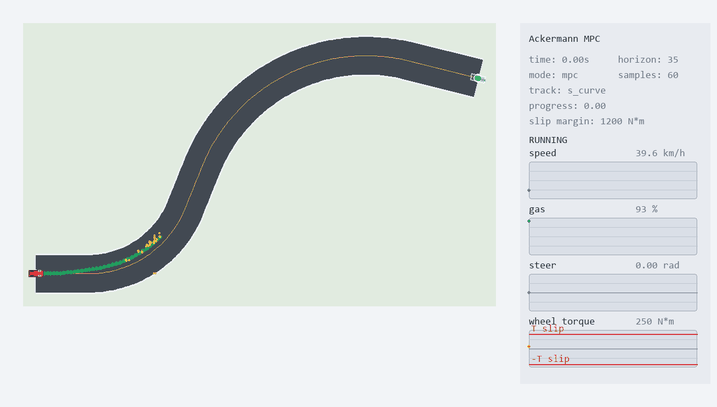
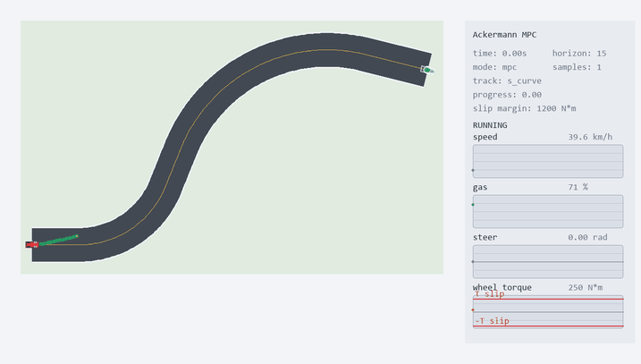
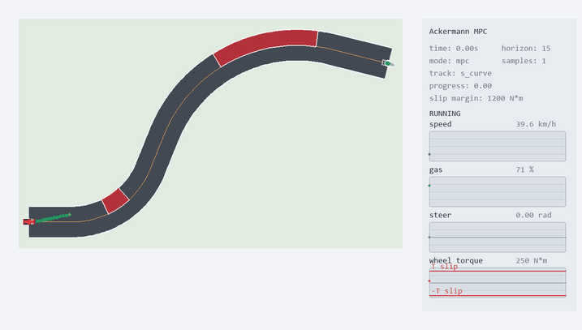

# Ackermann Racing MPC on an S-Curve Track

## 1. Problem Definition

The project studies model predictive control for a rear-wheel-drive car on a
single S-shaped racing-track section. The car must drive from a fixed initial
state to a fixed terminal point and terminal orientation while maximizing the
exit speed.

The control inputs are rear-wheel torque command and steering command. The plant
contains Ackermann steering, longitudinal acceleration, steering actuator
dynamics, torque actuator dynamics, track constraints, and tire-grip limits.

The main objective is

```math
s(t) \rightarrow s_f,
\qquad
\psi(t) \rightarrow \psi_f,
\qquad
v(t_f) \rightarrow \max
```

subject to

```math
(x(t),y(t)) \in \mathcal{T},
\qquad
\mathrm{grip}(s(t)) \le 1.
```

The final scenario also adds obstacles on the racing line. In that case the MPC
must avoid blocked apex regions and still finish at high speed.

## 2. Main Results

| Case | Controller | Horizon | Samples | Success | Time, s | Exit speed, km/h | Path, m | Min edge margin, m | Min obstacle margin, m | Mean solve, ms |
| --- | --- | ---: | ---: | --- | ---: | ---: | ---: | ---: | ---: | ---: |
| S-curve | CasADi MPC | 15 | - | yes | 7.92 | 96.72 | 163.16 | 3.05 | - | 740.73 |
| S-curve | CasADi MPC | 35 | - | yes | 8.16 | 91.66 | 163.15 | 2.78 | - | 25359.03 |
| S-curve | CasADi MPC | 45 | - | yes | 8.24 | 85.13 | 165.16 | 2.98 | - | 5569.15 |
| S-curve | Sampling MPC | 35 | 60 | yes | 8.80 | 90.29 | 161.86 | 3.27 | - | 436.85 |
| Obstacles, inside apexes | CasADi MPC | 15 | - | yes | 8.80 | 91.31 | 169.81 | 2.82 | 1.65 | 1515.87 |
| Obstacles, second outside | CasADi MPC | 15 | - | yes | 8.48 | 96.89 | 165.37 | 2.74 | 1.74 | 947.35 |
| Obstacles, second outside wall | CasADi MPC | 15 | - | yes | 8.40 | 96.26 | 164.64 | 2.70 | 1.74 | 714.90 |

## 3. Notation

The notation follows the course convention:

| Symbol | Meaning | Unit |
| --- | --- | --- |
| `s` | system state | mixed |
| `a` | action / control command | mixed |
| `o` | observation | mixed |
| `t` | time | s |
| `p` | plant transition / dynamics | - |
| `b` | disturbance or uncertainty | - |

For this project the continuous state is

```math
s =
\begin{bmatrix}
x & y & \psi & v & \delta & T
\end{bmatrix}^T
```

where `x,y` are the car coordinates, `psi` is heading, `v` is speed, `delta` is
the steering angle, and `T` is the actual rear-wheel torque.

The action is

```math
a =
\begin{bmatrix}
T_{\mathrm{cmd}} & \delta_{\mathrm{cmd}}
\end{bmatrix}^T.
```

The plant is controlled, deterministic, continuous-time, nonlinear, and
non-stationary only through the finite-horizon MPC replanning problem:

```math
\dot{s}=p(s,a),
\qquad
s \in \mathbb{R}^6,
\qquad
a \in \mathbb{R}^2.
```

## 4. Mathematical Model

The car is modeled as a kinematic bicycle with rear-wheel torque actuation. The
main parameters are chosen to be close to a lightweight rear-wheel-drive sports
car, approximately Mazda MX-5 / Miata class.

| Parameter | Value |
| --- | ---: |
| Mass `m` | `1070 kg` |
| Wheelbase `L` | `2.31 m` |
| Rear wheel radius `r_w` | `0.308 m` |
| Initial speed `v_0` | `11.0 m/s = 39.6 km/h` |
| Initial rear torque `T_0` | `250 N m` |
| Maximum torque command | `1800 N m` |
| Rear slip torque threshold | `1450 N m` |
| Maximum steering angle | `0.62 rad` |
| Simulation step | `0.08 s` |

The continuous-time dynamics are

```math
\dot{x}=v\cos\psi
```

```math
\dot{y}=v\sin\psi
```

```math
\dot{\psi}=\frac{v}{L}\tan\delta
```

```math
\dot{v}=
\frac{1}{m}
\left(
\frac{T}{r_w}
-c_dv|v|
-c_rv
\right)
```

The steering and torque commands are not applied instantly. They pass through
first-order actuator dynamics with rate limits:

```math
\dot{\delta}
=
\mathrm{sat}
\left(
\frac{\delta_{\mathrm{cmd}}-\delta}{\tau_\delta}
\right)
```

```math
\dot{T}
=
\mathrm{sat}
\left(
\frac{T_{\mathrm{cmd}}-T}{\tau_T}
\right).
```

The rear-wheel torque slip constraint is

```math
|T| \le T_{\mathrm{slip}}.
```

The lateral tire limit is approximated by the lateral acceleration

```math
a_y=\frac{v^2}{L}\tan\delta.
```

The controller also monitors combined grip usage. A rollout is invalid if the
car leaves the track, exceeds the rear torque limit, or exceeds the lateral /
combined tire limit.

## 5. Track and Obstacle Model

The track is one fixed S-shaped section with two arcs of different radii:

| Segment | Parameter |
| --- | ---: |
| Entry straight | `16 m` |
| First arc | `R = 32 m`, `68 deg` |
| Transition straight | `14 m` |
| Second arc | `R = 54 m`, `82 deg` |
| Exit straight | `22 m` |
| Track width | `12 m` |

The track is represented by a piecewise centerline. The signed lateral
coordinate is measured relative to the centerline; the track boundary is

```math
|e_y| \le 6~\mathrm{m}.
```

Obstacle scenarios use rectangular regions in Frenet coordinates:

```math
|s-s_o| \le h_s,
\qquad
|e_y-e_{y,o}| \le h_y.
```

For visualization, long obstacles are sampled along the track offset curves, so
they appear as curved strips following the road instead of straight polygons.

## 6. PID Evaluation

The PID controller is used as the first feedback baseline for driving through
the S-curve. It acts on the lateral error relative to the track centerline and
outputs a steering command. A separate proportional speed loop commands rear
wheel torque.

Let

```math
e_y=y_{\mathrm{car}}-y_{\mathrm{centerline}}
```

denote the signed lateral displacement from the closest point on the track
centerline. Positive `e_y` means that the car is to the left of the centerline.
The integral and derivative terms are

```math
I_y(t)=\int e_y(t)\,dt,
\qquad
\dot e_y(t)=\frac{d e_y}{dt}.
```

The steering command combines PID lateral correction, heading correction, and
curvature feed-forward:

```math
\delta_{\mathrm{cmd}}
=
\mathrm{sat}
\left(
\arctan(L\kappa)
-K_pe_y
-K_iI_y
-K_d\dot e_y
+K_\psi e_\psi
\right),
```

where `L` is the wheelbase, `kappa` is the centerline curvature at a lookahead
point, and `e_psi` is the heading error. The feed-forward term steers the car
into the bend before the lateral error becomes large, while the PID terms
correct the remaining tracking error.

The rear torque command is computed from a target speed error:

```math
T_{\mathrm{cmd}}=T_0+K_v(v_{\mathrm{ref}}-v).
```

The final tested lateral PID values are:

| Case | $K_p$ | $K_i$ | $K_d$ | Steps |
| --- | ---: | ---: | ---: | ---: |
| Conservative S-curve run | 0.03 | 0.002 | 0.015 | 104 |
| Intermediate S-curve run | 0.08 | 0.002 | 0.04 | 120 |
| Aggressive S-curve run | 0.52 | 0.002 | 0.24 | 208 |

PID baseline on the S-curve with conservative gains:
`Kp = 0.03`, `Ki = 0.002`, `Kd = 0.015`, 104 simulation steps.


| steps | time, s | progress | speed, km/h | gas, % |
| ---: | ---: | ---: | ---: | ---: |
| 104 | 8.32 | 0.99 | 91.2 | 70 |

| slip margin, N*m | steer, rad | wheel torque, N*m |
| ---: | ---: | ---: |
| 446 | 0.00 | 1004 |

PID baseline on the S-curve with intermediate gains:
`Kp = 0.08`, `Ki = 0.002`, `Kd = 0.04`, 120 simulation steps.


| steps | time, s | progress | speed, km/h | gas, % |
| ---: | ---: | ---: | ---: | ---: |
| 120 | 9.60 | 0.99 | 66.6 | 21 |

| slip margin, N*m | steer, rad | wheel torque, N*m |
| ---: | ---: | ---: |
| 1140 | -0.02 | 310 |

More aggressive PID tuning:
`Kp = 0.52`, `Ki = 0.002`, `Kd = 0.24`, 208 simulation steps.


| steps | time, s | progress | speed, km/h | gas, % |
| ---: | ---: | ---: | ---: | ---: |
| 208 | 16.64 | 0.99 | 35.1 | 10 |

| slip margin, N*m | steer, rad | wheel torque, N*m |
| ---: | ---: | ---: |
| 1308 | 0.02 | 142 |

The practical conclusion is similar to the earlier PID studies: PID is simple,
transparent, and easy to tune manually, but its behavior depends strongly on
gain selection. Low gains give smooth motion with slower correction; high gains
improve immediate response at the cost of stronger steering transients.

For this task, PID is applicable only as a local centerline-tracking controller.
It works when the desired path is fixed, the road is clear, and the car only has
to reduce lateral and heading errors. If an obstacle appears on the road, PID
does not have a mechanism for choosing a new collision-free path: it will still
try to return to the same centerline unless an external planner changes the
reference. The same limitation appears in racing-line selection, overtaking, and
sudden track changes. PID can stabilize tracking of a known trajectory, but it
does not decide which trajectory should be followed.

## 7. General MPC Formulation

All MPC controllers use the same receding-horizon idea. At time `t`, the
controller receives the current state `s_t`, predicts the plant for `N` discrete
steps, solves a finite-horizon optimal control problem, applies only the first
action, and then replans from the next measured state:

```math
a_t = \pi_N(s_t),
\qquad
s_{t+1}=p_d(s_t,a_t).
```

The discrete prediction model is obtained by integrating the continuous
Ackermann plant over one simulation step:

```math
s_{k+1}=p_d(s_k,a_k)
\approx
s_k+\int_{t_k}^{t_k+\Delta t}p(s(\tau),a_k)\,d\tau.
```

The common constrained optimization template is

```math
\min_{a_0,\ldots,a_{N-1}}
J_N(s_0,a_{0:N-1})
=
\sum_{k=0}^{N-1}L(s_k,a_k,a_{k-1})
+\Phi(s_N)
```

subject to

```math
s_{k+1}=p_d(s_k,a_k),
\qquad
(x_k,y_k)\in\mathcal{T},
\qquad
\mathrm{grip}(s_k)\le 1,
\qquad
|T_k|\le T_{\mathrm{slip}}.
```

The controllers differ mainly in how this finite-horizon problem is solved:
sampling MPC evaluates many explicit rollouts, while CasADi MPC solves a
nonlinear program with state and input decision variables.

Common cost components:

| Term | Equation | Purpose |
| --- | --- | --- |
| Progress reward | `-w_p s_k / s_f` | Move forward along the track |
| Tangent speed reward | `-w_v v_k cos(psi_k-psi_ref)` | Reward speed in the useful direction |
| Exit speed reward | `-w_{v,f} v_N` | Maximize speed at the finish |
| Finish distance | `w_f ||r_N-r_f||^2` | Reach the target point |
| Heading error | `w_psi wrap(psi_k-psi_ref)^2` | Align with track and final pose |
| Track boundary | `w_e max(0, |e_y|-e_{max})^2` | Stay inside the road |
| Grip usage | `w_g max(0, grip_k-1)^2` | Avoid tire slip |
| Smooth controls | `w_u ||a_k-a_{k-1}||^2` | Reduce oscillations |

## 8. Sample MPC

The sampling controller generates candidate sequences of
`(T_cmd, delta_cmd)`, simulates each rollout, rejects invalid trajectories, and
applies only the first action of the best sequence.

Its objective approximates

```math
\min
\sum_{k=0}^{N-1}
L(s_k,a_k)
+L_{\mathrm{smooth}}(s_k,a_k,a_{k-1})
-w_vv_N.
```

The rollout cost rewards progress, tangent speed, high terminal speed, and early
throttle on corner exit. It penalizes leaving the racing corridor, steering
oscillation, torque jumps, lateral weaving, lateral jerk, and tire-limit usage.

Sampling MPC cost terms:

| Component | Equation | Effect |
| --- | --- | --- |
| Running progress | `135(1-s_k/s_f)` | Pushes the rollout toward the finish |
| Tangent speed | `-20 v_k cos(psi_k-psi_ref)` | Rewards speed aligned with the track |
| Progress-speed coupling | `-9(s_k/s_f)v_k` | Makes speed more valuable near the exit |
| Racing-line error | `w_r |e_{y,k}-e_{race}(s_k)|` | Pulls the car toward a handcrafted racing line |
| Control smoothness | `w_T Delta T_cmd^2 + w_delta Delta delta_cmd^2` | Suppresses torque and steering jumps |
| Track smoothness | `72 Delta e_y^2 + 18 Delta a_y^2` | Penalizes lateral weaving and lateral jerk |
| Invalid rollout | `10^6 + 10^4(1-s_k/s_f)` | Rejects slip and off-track candidates |
| Terminal progress | `5200(1-s_N/s_f)` | Forces finite-horizon progress |
| Terminal speed | `-260 v_N` | Rewards fast exit from the horizon |

The best successful sampling run in the current benchmark uses `N=35` and `60`
samples. It reaches the goal in `8.80 s` with `90.29 km/h` exit speed.



Sampling MPC benchmark:

| Horizon | Samples | Success | Reason | Time, s | Exit speed, km/h | Final distance, m | RMS lateral jerk, m/s^3 | RMS steer rate, rad/s |
| ---: | ---: | --- | --- | ---: | ---: | ---: | ---: | ---: |
| 35 | 60 | yes | goal | 8.80 | 90.29 | 3.62 | 33.30 | 0.86 |
| 15 | 60 | no | off track | 4.80 | 80.05 | 74.31 | 12.36 | 0.45 |
| 35 | 20 | yes | goal | 9.68 | 81.73 | 2.24 | 34.08 | 0.64 |
| 45 | 60 | no | off track | 8.64 | 86.55 | 11.72 | 22.56 | 0.46 |

The result shows the main weakness of the sampling approach: performance depends
strongly on the candidate set. A larger horizon or more samples does not
guarantee a better route unless the sampled actions contain the correct racing
line.

## 9. CasADi MPC

The CasADi controller solves a nonlinear program with IPOPT at every MPC step.
The decision variables are the predicted state and control sequence over the
horizon:

```math
\{s_0,\ldots,s_N,a_0,\ldots,a_{N-1}\}.
```

The optimization includes dynamic equality constraints,
track-boundary constraints, actuator limits, torque limits, grip penalties, and
terminal terms for the finish point, final heading, final steering angle, and
exit speed.

Only the first optimized action is applied:

```math
a_t = \pi_N(s_t),
\qquad
s_{t+1}=p(s_t,a_t),
```

then the problem is solved again from the new measured state.

The cost contains progress, final-point, final-heading, steering, torque,
smoothness, track-boundary, and grip terms. The terminal part rewards high exit
speed and penalizes missing the finish point:

```math
J =
\sum_{k=0}^{N-1}
\left(
w_s d_s^2
+w_e e_y^2
+w_\psi \psi_e^2
+w_a \|a_k-a_{k-1}\|^2
+w_g g_k^2
-w_v v_k
-w_T T_{\mathrm{cmd},k}
\right)
+J_N.
```

with

```math
J_N =
w_f d_f^2
+w_{\psi,f}\psi_f^2
+w_{\delta,f}\delta_N^2
-w_{v,f}v_N.
```

CasADi MPC cost terms:

| Component | Equation | Effect |
| --- | --- | --- |
| Finish gap | `(160+120 beta_exit)(s_f-s_k)_+ / s_f` | Keeps the optimizer moving forward |
| Lateral error | `(6.5+0.45 beta_f)e_{y,k}^2` | Keeps the car in a feasible corridor |
| Heading error | `(42+90 beta_exit+80 beta_f)psi_k^2` | Aligns the car, especially near finish |
| Dive-to-apex bias | `120 beta_d(psi_k-psi_d)^2 + 18 beta_d(e_y-e_d)^2` | Encourages early turn-in |
| Steering effort | `(0.4+9 beta_f)delta_cmd^2` | Avoids unnecessary steering near finish |
| Torque effort | `6e-6 T_cmd^2 + 0.014 min(0,T_cmd)^2` | Mildly regularizes torque and discourages braking |
| Control rate | `18 Delta T_cmd^2 + 360 Delta delta_cmd^2` | Smooths the optimized inputs |
| Lateral acceleration | `4(a_y/a_{y,max})^2` | Reduces tire-limit abuse |
| Edge barrier | `28000 max(0, |e_y|-e_{max})^2` | Keeps the car inside the track |
| Grip buffer | `3600 max(0, grip-1)^2` | Penalizes slip risk |
| Speed reward | `-(8+28 beta_exit+140 beta_f)v_{k+1}` | Rewards high speed, especially on exit |
| Terminal finish | `9000((s_f-s_N)_+/s_f)^2` | Makes the final predicted state reach the goal |
| Terminal pose | `6500(e_{y,N}/r_g)^2 + 7200 psi_N^2 + 16000 delta_N^2` | Enforces finish point, orientation, and straight steering |
| Terminal speed | `-(520+1800 beta_f)v_N` | Maximizes exit speed |

The current best non-obstacle run uses `N=15`. It reaches the goal in `7.92 s`
with an exit speed of `96.72 km/h`.



CasADi MPC benchmark:

| Horizon | Success | Reason | Time, s | Exit speed, km/h | Path, m | Final distance, m | RMS lateral jerk, m/s^3 | Mean solve, ms |
| ---: | --- | --- | ---: | ---: | ---: | ---: | ---: | ---: |
| 15 | yes | goal | 7.92 | 96.72 | 163.16 | 2.54 | 14.64 | 740.73 |
| 35 | yes | goal | 8.16 | 91.66 | 163.15 | 3.35 | 20.22 | 25359.03 |
| 45 | yes | goal | 8.24 | 85.13 | 165.16 | 2.19 | 21.34 | 5569.15 |

The important observation is that the shorter `N=15` CasADi horizon performs
best in the current tuning. Longer horizons are not automatically better because
the nonlinear program becomes harder to solve and the terminal cost can become
overly conservative near the finish.

## 10. MPC with Obstacles

The obstacle controller extends the CasADi MPC with obstacle-avoidance costs and
constraints in track coordinates. Three obstacle layouts were evaluated:

- `inside`: both apexes are blocked on the inside half of the track;
- `second_outside`: the first obstacle is inside, the second is outside;
- `second_outside_wall`: the second obstacle becomes a long curved wall on the
  outside half of the second turn and ends before the finish.

The obstacle cost adds a soft distance barrier around each blocked Frenet
rectangle:

```math
J_{\mathrm{obs}}
=
\sum_{k=0}^{N}
\sum_i
w_{\mathrm{obs}}
\left[
\max(0, h_{s,i}-|s_k-s_i|)
\max(0, h_{y,i}-|e_{y,k}-e_{y,i}|)
\right]^2.
```

The simulation also checks the real plant trajectory for obstacle collision. A
state is invalid if the projected track coordinate enters an obstacle with a
safety margin.

Obstacle MPC cost terms:

| Component | Equation | Effect |
| --- | --- | --- |
| Base CasADi MPC | `J_{casadi}` | Keeps the racing objective and finish requirements |
| Obstacle overlap in `s` | `d_s=max(0,h_s-|s_k-s_o|)` | Activates near the obstacle longitudinal span |
| Obstacle overlap in lateral coordinate | `d_y=max(0,h_y-|e_{y,k}-e_{y,o}|)` | Activates near the blocked track half |
| Obstacle barrier | `w_obs(d_s d_y)^2` | Pushes trajectories away from blocked regions |
| Collision invalidation | `contains(s,e_y,margin)` | Ends the rollout if the real trajectory hits an obstacle |
| Obstacle safety metric | `min_i distance_to_obstacle_i` | Reported as minimum obstacle margin |

The most recent obstacle scenario blocks the outside half of the second turn
from the second apex region along the track and ends before the finish so that
the target point remains reachable. The obstacle is rendered as a curved strip
following the track geometry.



The benchmark compares time to finish, exit speed, path length, smoothness, grip
usage, and computational cost. The full CSV files are:

- [results/mpc_benchmark_metrics.csv](results/mpc_benchmark_metrics.csv)
- [results/mpc_benchmark_sample.csv](results/mpc_benchmark_sample.csv)
- [results/mpc_benchmark_casadi_h15.csv](results/mpc_benchmark_casadi_h15.csv)
- [results/obstacle_mpc_metrics_all.csv](results/obstacle_mpc_metrics_all.csv)
- [results/obstacle_mpc_second_outside_wall_metrics.csv](results/obstacle_mpc_second_outside_wall_metrics.csv)

| Layout | Success | Time, s | Exit speed, km/h | Path, m | Min obstacle margin, m | RMS lateral jerk, m/s^3 |
| --- | --- | ---: | ---: | ---: | ---: | ---: |
| `inside` | yes | 8.80 | 91.31 | 169.81 | 1.65 | 27.21 |
| `second_outside` | yes | 8.48 | 96.89 | 165.37 | 1.74 | 18.91 |
| `second_outside_wall` | yes | 8.40 | 96.26 | 164.64 | 1.74 | 36.26 |

Obstacle-aware CasADi MPC reaches the same final point in all evaluated layouts,
including the long outside-wall case. The obstacle route is slower and less
smooth than the nominal best CasADi run, but it remains feasible and keeps a
positive obstacle margin.

## 11. Reproducibility

Install dependencies:

```powershell
python -m venv .venv
.\.venv\Scripts\activate
pip install -r requirements.txt
```

Run the interactive sampling MPC:

```powershell
python -B .\scripts\play_sample_mpc.py
```

Run the interactive CasADi MPC:

```powershell
python -B .\scripts\play_casadi_mpc.py --horizon 15
```

Run the obstacle scenario:

```powershell
python -B .\scripts\play_obstacle_mpc.py --layout second_outside_wall --horizon 15
```

Regenerate the current GIFs:

```powershell
python -B .\scripts\record_sample_gif.py --horizon 35 --samples 60
python -B .\scripts\record_casadi_gif.py --horizon 15
python -B .\scripts\record_obstacle_gif.py --layout second_outside_wall --horizon 15
```

Regenerate metrics:

```powershell
python -B .\scripts\benchmark_mpc_metrics.py
python -B .\scripts\benchmark_obstacles.py --layouts inside,second_outside,second_outside_wall --horizon 15 --output results\obstacle_mpc_metrics_all.csv
```

## 12. References

1. J. B. Rawlings, D. Q. Mayne, and M. Diehl, *Model Predictive Control:
   Theory, Computation, and Design*, 2nd edition, Nob Hill Publishing, 2017.
2. L. Grune and J. Pannek, *Nonlinear Model Predictive Control: Theory and
   Algorithms*, Springer, 2017.
3. J. Betts, *Practical Methods for Optimal Control and Estimation Using
   Nonlinear Programming*, SIAM, 2010.
4. CasADi documentation, nonlinear optimization and IPOPT interface:
   <https://web.casadi.org/docs/>
5. Mazda USA News, MX-5 model information and engine torque:
   <https://news.mazdausa.com/vehicles-2026-mx-5>
6. Mazda USA specs PDF, MX-5 curb weight and wheelbase:
   <https://www.mazdausa.com/siteassets/pdf/owners-optimized/2020/mx-5-miata/2020-mx-5-miata-features-specs.pdf>
7. FIA Appendix O, circuit track-width guidance:
   <https://www.fia.com/sites/default/files/appendix_o_2022_published_30.09.2022.pdf>
8. Suzuka Circuit official map, S Curve inspiration:
   <https://www.suzukacircuit.jp/eng/f1/guide/look/pdf/map.pdf>
9. Silverstone official history, Maggotts-Becketts-Chapel inspiration:
   <https://www.silverstone.gp/en/history-of-the-circuit>
