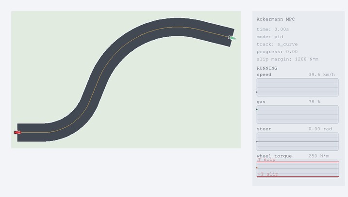

# Ackermann Racing MPC

Prototype for an Advanced Control Methods project: a car drives through one
fixed S-shaped racing-track section. The controller commands rear-wheel torque
and steering angle, while the plant includes steering and torque actuator
dynamics.

## Related Simulators

Good existing systems for full racing simulation:

- F1TENTH Gym / Gymnasium: lightweight autonomous racing simulator with
  Ackermann-style vehicle models.
- CommonRoad: benchmark ecosystem with vehicle models and motion-planning
  scenarios.
- CARLA: high-fidelity autonomous driving simulator, useful but heavy for a
  small course project.
- CasADi: strong tool for nonlinear MPC if installed; not currently installed in
  this local Python environment.

This folder keeps the runtime lightweight and local: no ROS, no CARLA server,
and no external solver dependency beyond Python packages already available here.

## Plant

The model uses SI units internally:

- distance: meters `m`
- time: seconds `s`
- speed: meters per second internally, displayed as `km/h`
- rear-wheel torque: Newton-meters `N*m`
- steering angle: radians

The default parameters are chosen to be close to a lightweight rear-wheel-drive
sports car, roughly Mazda MX-5 / Miata class:

| parameter | value |
| --- | ---: |
| mass `m` | `1070 kg` |
| wheelbase `L` | `2.31 m` |
| rear wheel rolling radius `r_w` | `0.308 m` |
| initial speed `v_0` | `11.0 m/s = 39.6 km/h` |
| initial rear torque `T_0` | `250 N*m` |
| rear slip threshold `T_slip` | `1450 N*m` |
| first S-bend radius | `32 m` |
| second S-bend radius | `54 m` |
| track width | `12 m` |

State:

```math
s =
\begin{bmatrix}
x & y & \psi & v & \delta & T
\end{bmatrix}^\top
```

where:

- `x, y` are continuous car coordinates
- `psi` is heading
- `v` is speed
- `delta` is steering angle
- `T` is rear-wheel torque

Action:

```math
a =
\begin{bmatrix}
T_{\text{cmd}} & \delta_{\text{cmd}}
\end{bmatrix}^\top
```

Ackermann / kinematic bicycle dynamics:

```math
\dot{x} = v \cos \psi
```

```math
\dot{y} = v \sin \psi
```

```math
\dot{\psi} = \frac{v}{L}\tan\delta
```

Longitudinal dynamics:

```math
\dot{v}
=
\frac{1}{m}
\left(
\frac{T}{r_w}
- c_d v|v|
- c_r v
\right)
```

Actuator dynamics:

```math
\dot{\delta}
=
\mathrm{sat}
\left(
\frac{\delta_{\text{cmd}}-\delta}{\tau_\delta}
\right)
```

```math
\dot{T}
=
\mathrm{sat}
\left(
\frac{T_{\text{cmd}}-T}{\tau_T}
\right)
```

Invalid states:

```math
|T| > T_{\text{slip}}
```

rear-wheel slip, and:

```math
(x,y) \notin \mathcal{T}
```

leaving the track.

## Track

The track is now one fixed S-shaped section represented by a piecewise
centerline:

| segment | length / radius |
| --- | ---: |
| entry straight | `16 m` |
| first left arc | `R = 32 m`, `68 deg` |
| transition straight | `14 m` |
| second right arc | `R = 54 m`, `82 deg` |
| exit straight | `22 m` |

The track boundary is defined by a `12 m` width around that centerline. The
curvature changes sign between the two arcs, so the task is now a true S-curve
rather than one isolated bend.

Default start:

```math
\psi_0 \approx 0,\quad v_0 = 11.0\,m/s,\quad \delta_0 = 0,\quad T_0 = 250\,N\,m
```

The final orientation is the tangent heading at the S-section exit.

## MPC

The current controller is sampling-based MPC:

1. sample candidate sequences of `(T_cmd, delta_cmd)`
2. include aggressive racing-line candidates with early near-full throttle
3. simulate the plant over horizon `N`
4. reject or heavily penalize slip and off-track rollouts
5. reward progress through the bend
6. reward high terminal speed and early throttle at corner exit
7. penalize oscillatory steering, torque jumps, lateral weaving, and lateral acceleration jumps
8. apply only the first control, then replan

The objective approximates:

```math
\min
\sum_{k=0}^{N-1}
L(s_k,a_k)
R_{\text{smooth}}(s_k,a_k,a_{k-1})
-
w_v v_N
```

subject to:

```math
s_{k+1} = p(s_k,a_k),
\quad
|T_k| \leq T_{\text{slip}},
\quad
(x_k,y_k)\in\mathcal{T}
```

## PID Control Evaluation

The PID controller is used as the first feedback baseline for driving through
the S-curve. It acts on the lateral error relative to the track centerline and
outputs a steering command. A separate proportional speed loop commands rear
wheel torque.

Let

```math
e_y=y_{\mathrm{car}}-y_{\mathrm{centerline}}
```

denote the signed lateral displacement from the closest point on the track
centerline. Positive `e_y` means that the car is to the left of the centerline.
The integral and derivative terms are

```math
I_y(t)=\int e_y(t)\,dt,
\qquad
\dot e_y(t)=\frac{d e_y}{dt}.
```

The steering command combines PID lateral correction, heading correction, and
curvature feed-forward:

```math
\delta_{\mathrm{cmd}}
=
\mathrm{sat}
\left(
\arctan(L\kappa)
-K_pe_y
-K_iI_y
-K_d\dot e_y
+K_\psi e_\psi
\right),
```

where `L` is the wheelbase, `kappa` is the centerline curvature at a lookahead
point, and `e_psi` is the heading error. The feed-forward term steers the car
into the bend before the lateral error becomes large, while the PID terms
correct the remaining tracking error.

The rear torque command is computed from a target speed error:

```math
T_{\mathrm{cmd}}=T_0+K_v(v_{\mathrm{ref}}-v).
```

The final tested lateral PID values are:

| Case | $K_p$ | $K_i$ | $K_d$ | Steps |
| --- | ---: | ---: | ---: | ---: |
| Conservative S-curve run | 0.03 | 0.002 | 0.015 | 104 |
| Intermediate S-curve run | 0.08 | 0.002 | 0.04 | 120 |
| Aggressive S-curve run | 0.52 | 0.002 | 0.24 | 208 |

PID baseline on the S-curve with conservative gains:
`Kp = 0.03`, `Ki = 0.002`, `Kd = 0.015`, 104 simulation steps.



| steps | time, s | progress | speed, km/h | gas, % |
| ---: | ---: | ---: | ---: | ---: |
| 104 | 8.32 | 0.99 | 91.2 | 70 |

| slip margin, N*m | steer, rad | wheel torque, N*m |
| ---: | ---: | ---: |
| 446 | 0.00 | 1004 |

PID baseline on the S-curve with intermediate gains:
`Kp = 0.08`, `Ki = 0.002`, `Kd = 0.04`, 120 simulation steps.


| steps | time, s | progress | speed, km/h | gas, % |
| ---: | ---: | ---: | ---: | ---: |
| 120 | 9.60 | 0.99 | 66.6 | 21 |

| slip margin, N*m | steer, rad | wheel torque, N*m |
| ---: | ---: | ---: |
| 1140 | -0.02 | 310 |

More aggressive PID tuning:
`Kp = 0.52`, `Ki = 0.002`, `Kd = 0.24`, 208 simulation steps.


| steps | time, s | progress | speed, km/h | gas, % |
| ---: | ---: | ---: | ---: | ---: |
| 208 | 16.64 | 0.99 | 35.1 | 10 |

| slip margin, N*m | steer, rad | wheel torque, N*m |
| ---: | ---: | ---: |
| 1308 | 0.02 | 142 |

The practical conclusion is similar to the earlier PID studies: PID is simple,
transparent, and easy to tune manually, but its behavior depends strongly on
gain selection. Low gains give smooth motion with slower correction; high gains
improve immediate response at the cost of stronger steering transients.

## Run

From this folder:

```powershell
python play_pygame.py
```

Manual mode:

```powershell
python play_pygame.py --manual
```

The right panel shows live telemetry graphs for current speed, gas command,
steering angle, and actual rear-wheel torque. The torque graph marks the
traction limit `T_slip` with red horizontal lines.

Controls:

- Up / Down: increase / decrease rear torque command
- Left / Right: steer left / right
- Space: set torque command to zero
- M: toggle MPC autoplay
- [ / ]: decrease / increase horizon
- - / =: decrease / increase samples
- R: reset
- Esc or Q: quit

## Parameter Sources

The car parameters are approximate and intentionally simple. They are scaled to
the Mazda MX-5 class: Mazda lists the MX-5 as front-engine, rear-wheel drive
with `151 lb-ft` engine torque, and Mazda brochure/spec sources list curb masses
around `2341-2452 lb` and wheelbase around `2309 mm`. The tire radius uses a
typical MX-5 `205/45R17` tire diameter estimate. The `12 m` track width follows
the FIA Appendix O recommendation that circuit track width should generally be
at least `12 m`.

References:

- Mazda USA News, MX-5 model information and engine torque:
  <https://news.mazdausa.com/vehicles-2026-mx-5>
- Mazda USA specs PDF, MX-5 curb weight and wheelbase:
  <https://www.mazdausa.com/siteassets/pdf/owners-optimized/2020/mx-5-miata/2020-mx-5-miata-features-specs.pdf>
- FIA Appendix O, circuit track-width guidance:
  <https://www.fia.com/sites/default/files/appendix_o_2022_published_30.09.2022.pdf>

Track-shape inspiration:

- Suzuka official circuit map, including the S Curve section:
  <https://www.suzukacircuit.jp/eng/f1/guide/look/pdf/map.pdf>
- Silverstone official history, including the Maggotts-Becketts-Chapel
  left-right-left-right-left sequence:
  <https://www.silverstone.gp/en/history-of-the-circuit>
