# Adaptive Control for Aerial Refueling Station Keeping

This project studies an adaptive controller for a simplified aerial refueling
task. The receiver aircraft must stay close to a fixed refueling point in the
relative frame of the tanker while its mass increases during fuel transfer.

The central control difficulty is that the same aerodynamic correction force
produces a smaller acceleration when the aircraft becomes heavier. A controller
that assumes a fixed nominal mass may therefore become too weak during
refueling. The adaptive controller estimates the inverse mass online and uses
this estimate to scale the control forces.

## Project Structure

The project is organized as follows:

1. Problem Definition.
2. Main Results.
3. Notation.
4. Mathematical Model.
5. Modeling Assumptions.
6. From Full Forces to the Perturbation Model.
7. State-Space Model.
8. Generated Results:
   Zero Controller, PD Controller, Adaptive Controller, and Controller
   Comparison.
9. Implementation.
10. Reproducibility.
11. References.

## Problem Definition

We consider the receiver aircraft in the vertical longitudinal plane. The
coordinate frame is attached to the tanker and moves with its nominal refueling
flight condition. The tanker-side refueling point is fixed at the origin of
this relative frame, so the absolute motion of the tanker is not modeled
explicitly.

The receiver starts from a large initial relative offset in this tanker-attached
frame. The objective is to drive the receiver-side refueling point to the
tanker-side refueling point and then keep it inside the refueling zone
$\|r(t)\|\le R$. Thus, the radius $R=1$ m is a target zone after entry, not a
constraint that must already be satisfied at the initial time.

The increasing receiver mass is treated as a prescribed time-varying
uncertainty in the refueling-mode model. The contact/capture switching logic
that would turn fuel flow on only after physical engagement is not modeled in
this version. In the animations, the tanker is kept fixed and the refueling
hose/drogue is drawn as connected to the receiver to emphasize that the
simulation studies relative recovery and stabilization under changing mass.

In this reduced model, the aircraft attitude and the fixed geometric offset
between the aircraft center of mass and the probe tip are handled by lower-level
loops, so the high-level state describes the receiver-side refueling point
directly.


<a href="figures/refueling_model_forces.png">
  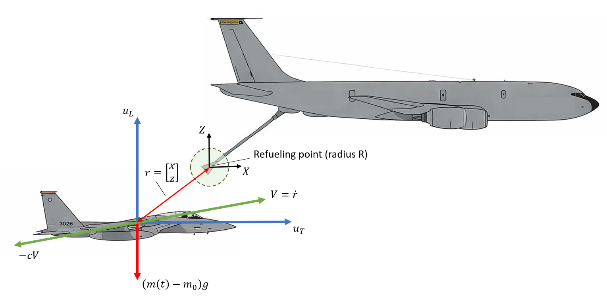
</a>

## Main Results

| Controller | Final distance to refueling point | Enters $R=1$ m zone | Main observation |
| --- | ---: | :---: | --- |
| Zero controller | $1096.02$ m | No | The open-loop receiver drifts away as the mass-induced gravity mismatch grows. |
| Nominal-mass PD controller | $28.99$ m | No | Simple feedback damps the motion, but a fixed mass assumption leaves a vertical offset. |
| Adaptive inverse-mass controller | $0.52$ m | Yes | Online inverse-mass adaptation keeps the receiver inside the refueling zone. |

## Notation

| Symbol | Meaning |
| --- | --- |
| $r=[x,z]^T$ | Relative position of the receiver-side refueling point with respect to the tanker-side refueling point. |
| $v=[v_x,v_z]^T=\dot r$ | Relative velocity. |
| $u=[u_T,u_L]^T$ | Incremental force correction: longitudinal thrust and vertical lift. |
| $m(t)$ | True receiver mass during refueling. |
| $m_0$ | Initial receiver mass. |
| $\theta(t)=1/m(t)$ | True inverse mass. |
| $\hat\theta(t)$ | Adaptive estimate of inverse mass. |
| $\hat m(t)=1/\hat\theta(t)$ | Reported adaptive mass estimate. |
| $C=\mathrm{diag}(c_x,c_z)$ | Linearized damping matrix. |
| $\xi_z=[0,1]^T$ | Vertical unit vector. |
| $R$ | Refueling-zone radius. |
| $e=v+\Lambda r$ | Filtered tracking error used by the adaptive controller. |

## Mathematical Model

The control objective is

```math
x(t)\to 0,\qquad z(t)\to 0,\qquad v_x(t)\to 0,\qquad v_z(t)\to 0,
```

while the receiver mass changes due to fuel inflow.

The state is

```math
s = \begin{bmatrix} x \\ z \\ v_x \\ v_z \end{bmatrix},
```

where

- $x$ is the longitudinal displacement of the receiver-side refueling point
  from the desired tanker-side refueling point,
- $z$ is the vertical displacement of the receiver-side refueling point from
  the desired tanker-side refueling point,
- $v_x=\dot x$ is the relative longitudinal velocity,
- $v_z=\dot z$ is the relative vertical velocity.

We also use the compact notation

```math
r = \begin{bmatrix} x \\ z \end{bmatrix}, \qquad v = \begin{bmatrix} v_x \\ v_z \end{bmatrix}.
```

The refueling zone is represented by a circle

```math
\|r(t)\| = \sqrt{x(t)^2+z(t)^2}\le R.
```

In this first version, the circle is used as a performance metric, not as a hard
safety constraint.

The default radius is set to

```math
R=1\ \mathrm{m}.
```

This value is chosen as a realistic order-of-magnitude refueling window: the
diameter of the refueling basket or drogue used by tanker aircraft is about one
meter. Therefore, keeping the receiver-side refueling point within a 1 m
neighborhood is a meaningful station-keeping requirement for this simplified
model.

The control inputs in this model are incremental force corrections. Their
values can reach tens or hundreds of thousands of newtons. This is still a
realistic aircraft-scale order of magnitude: for example, the thrust of a jet
fighter engine can be around $330\,000$ N, so the simulated force corrections
are not outside the range of physically meaningful aircraft control authority.

## Modeling Assumptions

The full dynamics of an aircraft include pitch, angle of attack, elevator
deflection, engine dynamics, lift curves, drag curves, actuator limits, and
many other effects. Modeling all of these would make the project much larger
than the adaptive-control objective.

We therefore use a reduced-order perturbation model around a nominal refueling
flight condition.

The assumptions are:

- the tanker-relative refueling point is fixed in the $(x,z)$ frame;
- the receiver remains close to the nominal refueling flight condition;
- low-level aircraft loops track commanded thrust and lift corrections;
- the high-level controller commands only incremental force corrections;
- the mass increases during refueling and is not exactly known to the
  controller;
- wind is not included in the first controller design.

The commanded control input is

```math
u = \begin{bmatrix} u_T \\ u_L \end{bmatrix},
```

where

- $u_T$ is the incremental longitudinal thrust correction,
- $u_L$ is the incremental vertical lift correction.

These are not the full engine thrust and full wing lift. They are high-level
force corrections around the nominal trimmed flight regime.

## From Full Forces to the Perturbation Model

A simple longitudinal-vertical force model may be written as

```math
m(t)\dot v_x = T - D_x,
```

```math
m(t)\dot v_z = L - m(t)g - D_z,
```

where

- $T$ is thrust,
- $L$ is lift,
- $D_x$ and $D_z$ are aerodynamic damping or drag-like terms,
- $g$ is gravitational acceleration,
- $m(t)$ is the receiver mass.

In nominal trimmed flight before refueling, the aircraft is assumed to satisfy

```math
T_0 = D_{x,0}, \qquad L_0 = m_0 g,
```

where $m_0$ is the initial mass. This means that the nominal thrust balances
drag and the nominal lift balances weight.

During refueling, we write

```math
T = T_0 + u_T, \qquad L = L_0 + u_L.
```

For small relative velocities around the nominal flight condition, the drag and
damping corrections are approximated by a linear model:

```math
D_x-D_{x,0}\approx c_x v_x, \qquad D_z\approx c_z v_z,
```

where $c_x>0$ and $c_z>0$ are linearized damping coefficients. This is not a
claim that aerodynamic drag is globally linear. It is a local first-order model
around the refueling flight condition.

Substituting these relations into the force balance gives

```math
m(t)\dot v_x = u_T - c_x v_x,
```

```math
m(t)\dot v_z = u_L - c_z v_z - (m(t)-m_0)g.
```

Thus the increasing mass has two effects:

1. it reduces acceleration per unit control force;
2. it creates a vertical gravity mismatch because the old nominal lift
   $L_0=m_0g$ no longer balances the new weight $m(t)g$.

## State-Space Model

Define

```math
C = \begin{bmatrix} c_x & 0 \\ 0 & c_z \end{bmatrix}, \qquad \xi_z = \begin{bmatrix} 0 \\ 1 \end{bmatrix}.
```

The model is

```math
\dot r = v,
```

```math
m(t)\dot v = u - Cv - (m(t)-m_0)g \xi_z.
```

Equivalently,

```math
\dot v = \theta(t)u - \theta(t)Cv - \bigl(1-m_0\theta(t)\bigr)g \xi_z,
```

where the inverse mass is

```math
\theta(t)=\frac{1}{m(t)}.
```

In component form:

```math
\dot x = v_x,
```

```math
\dot z = v_z,
```

```math
\dot v_x = \theta(t)(u_T-c_xv_x),
```

```math
\dot v_z = \theta(t)(u_L-c_zv_z) - \bigl(1-m_0\theta(t)\bigr)g.
```

The fuel inflow changes the true mass according to

```math
m(t)=m_0+\int_0^t q(\tau)d\tau,
```

where $q(t)$ is the fuel mass flow rate. The controller may know a nominal fuel
flow profile, but it does not know the exact true mass online.

## Generated Results

Each controller is first shown separately, then the controllers are compared on
the same initial condition.

### Zero Controller

The Zero controller has no tunable feedback parameters. Its command is
$u(t)=0$, so the aircraft is affected only by its initial relative velocity,
damping, and the vertical gravity mismatch caused by increasing mass.

Substituting $u=0$ into the plant gives

```math
\dot r = v,
```

```math
\dot v = -\theta(t)Cv-\bigl(1-m_0\theta(t)\bigr)g\xi_z.
```

The horizontal velocity is damped by $-\theta(t)c_xv_x$, but there is no term
that drives $x$ to zero. In the vertical channel, the term
$-\bigl(1-m_0\theta(t)\bigr)g\xi_z$ becomes nonzero as soon as $m(t)>m_0$,
which creates a downward acceleration mismatch.

Algorithmically, the Zero controller is just:

```text
given state s = [x, z, vx, vz]^T

u_T = 0
u_L = 0
return u = [u_T, u_L]^T
```

<a href="figures/zero_controller_approach_animation.gif">
  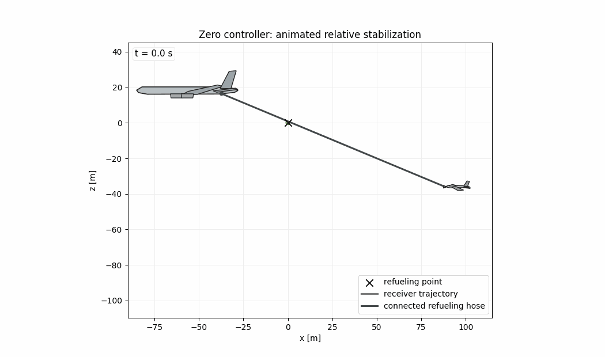
</a>

<a href="figures/zero_controller_tracking_summary.png">
  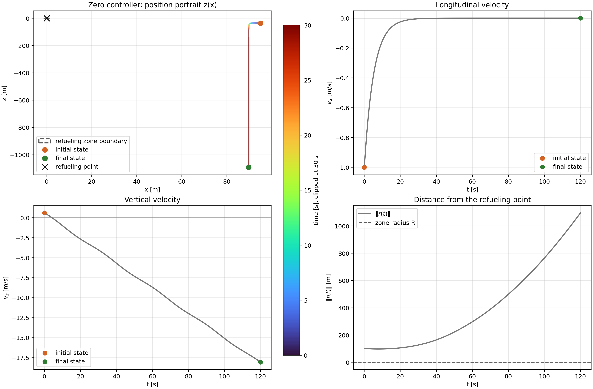
</a>

The plots show that the receiver does not approach the refueling point. The
vertical coordinate drifts away because the nominal lift $m_0g$ no longer
balances the increasing weight $m(t)g$. This confirms that the plant model is
not self-stabilizing for the refueling task.

The longitudinal velocity is initially negative because the default initial
condition is $v_x(0)=-1$ m/s: the receiver-side refueling point starts moving
toward the tanker-side target. With $u_T=0$, the longitudinal equation
$\dot v_x=-\theta c_xv_x$ only damps this velocity, so $v_x$ approaches zero
from below. The short nearly constant-height segment appears because
$v_z(0)=0.6$ m/s is upward and the mass mismatch is initially zero at
$m(0)=m_0$. As fuel is added, $m(t)>m_0$, the term
$-\bigl(1-m_0\theta(t)\bigr)g\xi_z$ grows, and the receiver begins drifting
downward.

<a href="figures/zero_controller_diagnostics.png">
  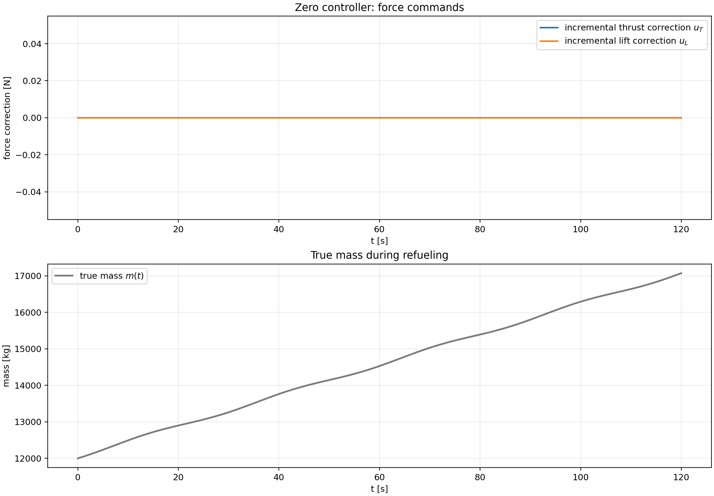
</a>

The force commands are identically zero, as expected. The mass plot is included
to show that the same refueling scenario is used for all controllers.

<a href="figures/zero_controller_phase_portraits.png">
  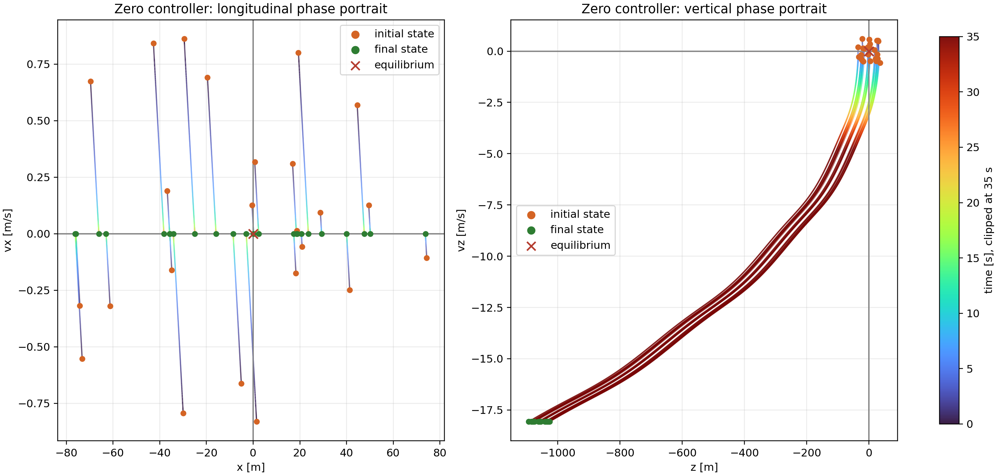
</a>

The phase portraits confirm the same behavior from multiple initial
conditions: without a stabilizing feedback term, trajectories do not converge
to the origin.

Final Zero-controller result:

```json
{
  "final_position_norm_m": 1096.019940085246,
  "final_velocity_norm_m_s": 18.07046360725809,
  "entered_refueling_zone": false
}
```

### PD Controller

The nominal-mass PD controller uses position and velocity feedback but does
not adapt the mass estimate. It assumes the nominal mass $m_0$ and commands

```math
a_{\mathrm{PD}} = -K_p r - K_d v,
```

where $a_{\mathrm{PD}}\in\mathbb{R}^2$ is the desired acceleration,
$K_p=\mathrm{diag}(k_{p,x},k_{p,z})$ is the proportional gain matrix, and
$K_d=\mathrm{diag}(k_{d,x},k_{d,z})$ is the derivative gain matrix. The
implemented force command is

```math
u_{\mathrm{PD}} = Cv + m_0 a_{\mathrm{PD}}.
```

Substituting this law into the true plant gives

```math
\dot v = \theta(t)m_0(-K_pr-K_dv) -\bigl(1-m_0\theta(t)\bigr)g\xi_z.
```

If $m(t)=m_0$, then $\theta(t)m_0=1$ and the main feedback term becomes the
standard second-order PD dynamics. During refueling $m(t)>m_0$, therefore
$\theta(t)m_0<1$: the feedback action is effectively weakened, and the vertical
gravity mismatch remains uncompensated.

The nominal-mass PD controller uses the following gains:

```json
{
  "kp_x": 0.09,
  "kp_z": 0.136,
  "kd_x": 0.60,
  "kd_z": 0.74,
  "nominal_mass_kg": 12000.0,
  "max_force_N": 180000.0
}
```

The implemented PD algorithm is:

```text
given state s = [x, z, vx, vz]^T

r = [x, z]^T
v = [vx, vz]^T
a_PD = -Kp r - Kd v
u = C v + m0 a_PD
u = saturate(u, -u_max, u_max)
return u
```

<a href="figures/pd_controller_approach_animation.gif">
  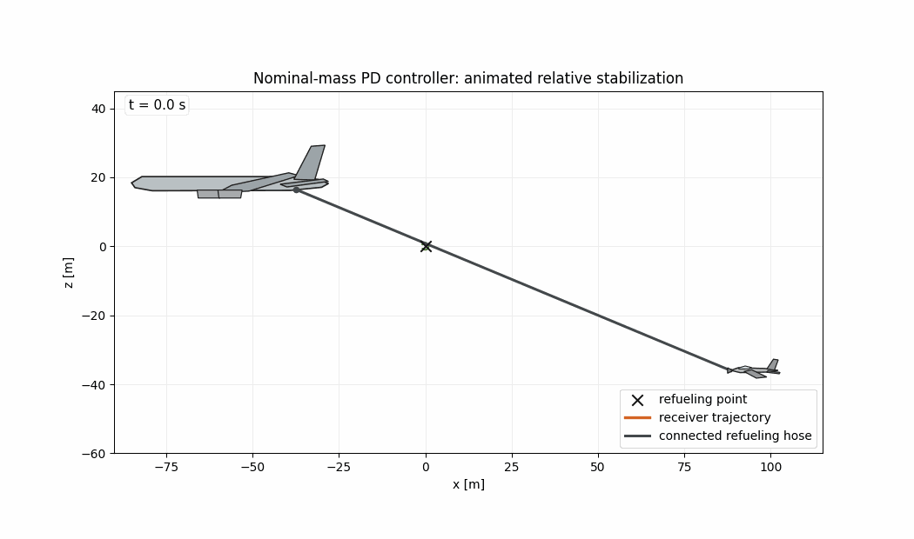
</a>

<a href="figures/pd_controller_tracking_summary.png">
  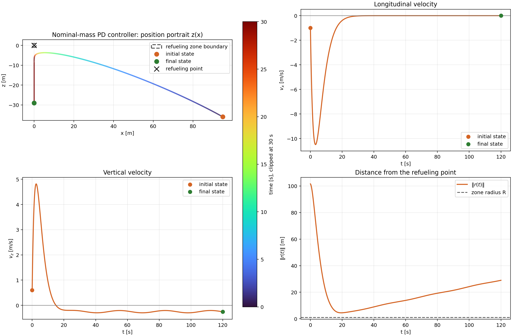
</a>

The PD controller damps the relative motion and brings the aircraft much closer
to the refueling point than the Zero controller. However, the final error is
still outside the required radius $R=1$ m. This happens because the controller
uses the fixed nominal mass $m_0$, while the real plant becomes heavier during
refueling.

<a href="figures/pd_controller_diagnostics.png">
  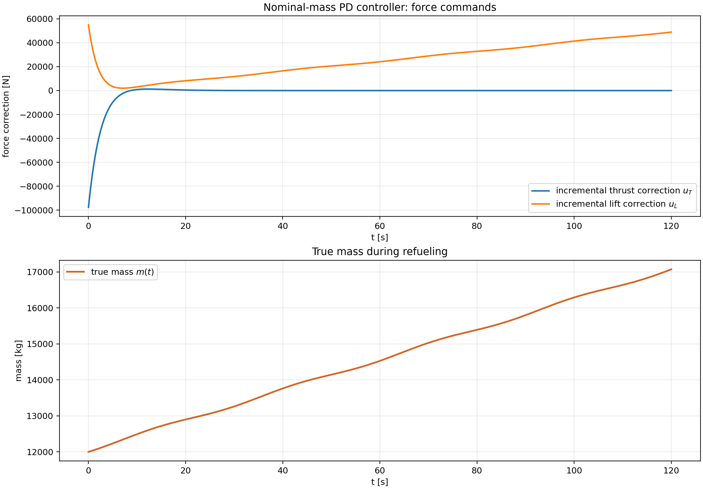
</a>

The force commands remain smooth, but they are computed with a fixed
mass-to-acceleration conversion. As the mass grows, the same force produces a
smaller acceleration, so the simple PD loop cannot remove the residual offset
in this scenario.

<a href="figures/pd_controller_phase_portraits.png">
  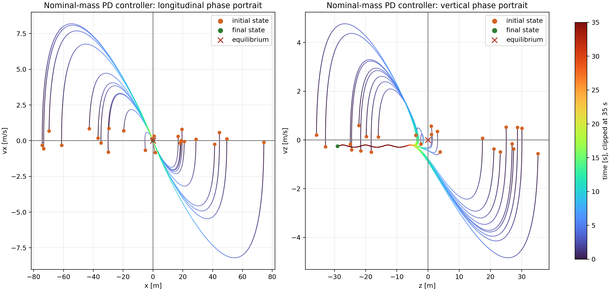
</a>

The phase portraits show damped motion, but convergence is toward a biased
region rather than the exact refueling equilibrium. This matches the residual
distance seen in the tracking plot.

Final PD-controller result:

```json
{
  "final_position_norm_m": 28.986177356773606,
  "final_velocity_norm_m_s": 0.25672385333305103,
  "entered_refueling_zone": false
}
```

### Adaptive Controller

The adaptive controller estimates the inverse mass

```math
\theta(t)=\frac{1}{m(t)}
```

online and uses the estimate $\hat\theta(t)$ in the force command. The compact
adaptive-control form of the plant is

```math
\dot v = \theta \phi(s,u) - g \xi_z, \qquad \phi(s,u)=u-Cv+m_0g\xi_z,
```

where $\phi(s,u)$ is the regressor-like force term multiplying the unknown
inverse mass.

The filtered tracking error is

```math
e=v+\Lambda r,
```

where $\Lambda=\mathrm{diag}(\lambda_x,\lambda_z)$ is positive definite.
If $e\to 0$, then $\dot r=-\Lambda r$, so the receiver-side refueling point
converges to the origin.

The certainty-equivalent adaptive force command is

```math
u = Cv-m_0g \xi_z + \frac{1}{\hat\theta} \left( -K e-\Lambda v+g \xi_z \right),
```

where $K=\mathrm{diag}(k_x,k_z)$ is positive definite. The estimate is
updated by

```math
\dot{\hat\theta} = \gamma e^T\phi(s,u),
```

with projection onto the admissible interval
$[\theta_{\min},\theta_{\max}]$. The plotted adaptive mass estimate is

```math
\hat m(t)=\frac{1}{\hat\theta(t)}.
```

In component form:

```math
u_T = c_xv_x + \frac{1}{\hat\theta} \left( -k_x e_x-\lambda_x v_x \right),
```

```math
u_L = c_zv_z-m_0g + \frac{1}{\hat\theta} \left( -k_z e_z-\lambda_z v_z+g \right).
```

Here $e_x$ and $e_z$ denote the two components of the filtered error $e$. The
vertical unit vector is denoted by $\xi_z$ and will be named `vertical_unit` in
the code.

The stability argument uses

```math
L(e,\tilde\theta) = \frac{1}{2}e^Te + \frac{1}{2\gamma}\tilde\theta^2, \qquad \tilde\theta=\theta-\hat\theta.
```

For constant unknown mass, the closed-loop error dynamics become
$\dot e=-Ke+\tilde\theta\phi$, and the adaptation law cancels the parameter
cross-term, giving

```math
\dot L=-e^TKe\le 0.
```

Thus the augmented error system is Lyapunov stable, and the filtered tracking
error converges under the standard boundedness assumptions used in direct
adaptive control. For slowly varying mass during refueling, the same argument
gives practical stability because an additional bounded term proportional to
$\dot\theta$ appears in $\dot L$.

Full derivation: [adaptive-control stability proof](docs/adaptive_control_stability_proof.pdf).

The adaptive inverse-mass controller uses the following parameters:

```json
{
  "lambda_x": 0.30,
  "lambda_z": 0.34,
  "k_x": 0.30,
  "k_z": 0.40,
  "gamma": 5.0e-12,
  "mass_hat_initial_kg": 12000.0,
  "mass_min_kg": 8000.0,
  "mass_max_kg": 18000.0,
  "max_force_N": 180000.0
}
```

The implemented adaptive algorithm is:

```text
given state s = [x, z, vx, vz]^T and current estimate theta_hat

r = [x, z]^T
v = [vx, vz]^T
e = v + Lambda r
desired = -K e - Lambda v + g xi_z
u = C v - m0 g xi_z + desired / theta_hat
u = saturate(u, -u_max, u_max)
phi = u - C v + m0 g xi_z
theta_hat_dot = gamma e^T phi
theta_hat = project(theta_hat + dt theta_hat_dot, theta_min, theta_max)
return u
```

<a href="figures/adaptive_controller_approach_animation.gif">
  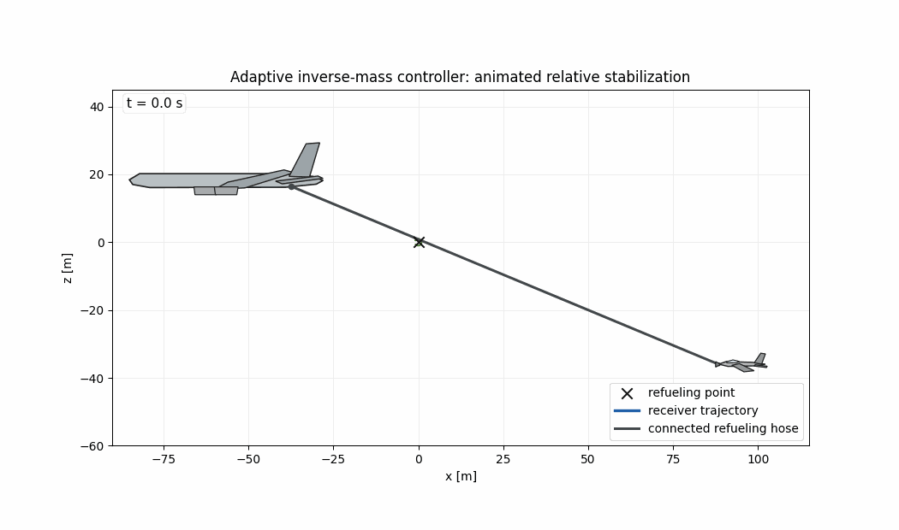
</a>

<a href="figures/adaptive_controller_tracking_summary.png">
  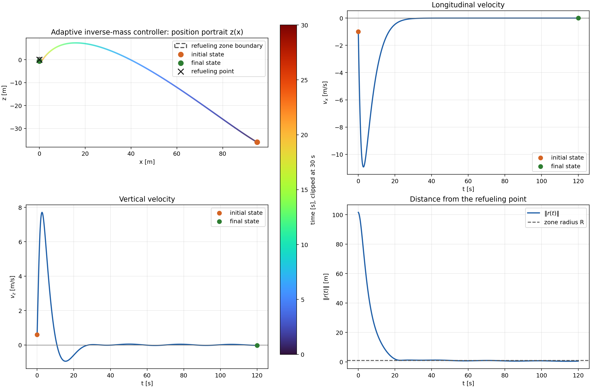
</a>

The adaptive controller drives the receiver into the refueling zone and keeps
it there. The velocity plots show that the transient motion is damped, while
the distance plot shows convergence below the required radius $R=1$ m.

<a href="figures/adaptive_controller_diagnostics.png">
  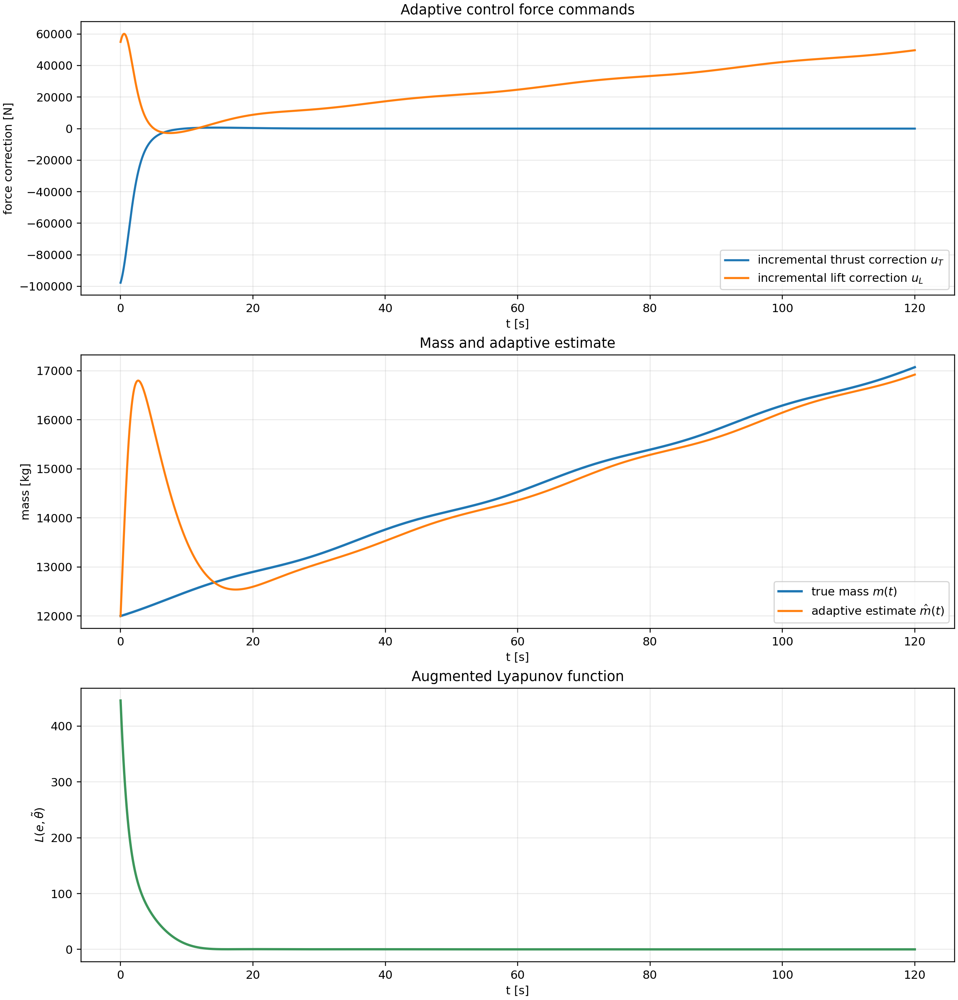
</a>

The adaptive diagnostics show smooth force commands, a mass estimate that
tracks the increasing mass trend, and a decreasing augmented Lyapunov value.
The estimate $\hat m(t)$ is used for stabilization; it is not claimed to be an
exact identifier of the physical mass.

<a href="figures/adaptive_controller_phase_portraits.png">
  
</a>

The phase portraits support the Lyapunov-based analysis: trajectories from
different initial states move toward the equilibrium region instead of
diverging.

Final adaptive-controller result:

```json
{
  "final_position_norm_m": 0.5230896452030871,
  "final_velocity_norm_m_s": 0.022440296640751662,
  "final_mass_kg": 17071.868276983434,
  "final_mass_hat_kg": 16920.54349573463,
  "final_lyapunov": 0.0475010587302382,
  "entered_refueling_zone": true,
  "stays_in_zone_after_first_entry": true
}
```

### Controller Comparison

<a href="figures/controller_comparison.png">
  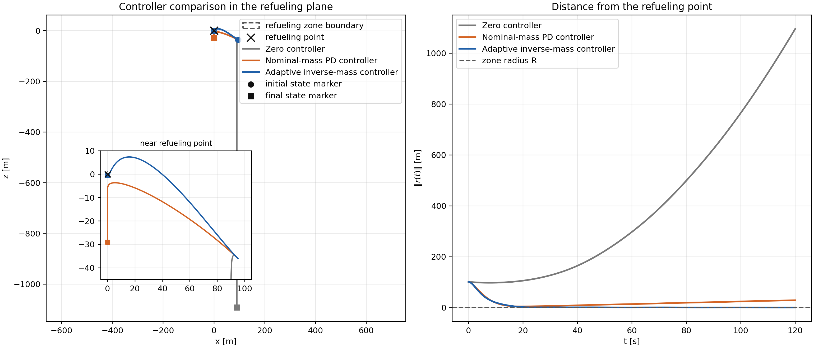
</a>

The comparison summarizes the role of adaptation. The Zero controller fails
because there is no corrective action. The nominal-mass PD controller stabilizes
the motion qualitatively, but it remains outside the 1 m refueling zone because
the fixed mass assumption becomes inaccurate. The adaptive controller updates
the inverse-mass estimate online and achieves the required station-keeping
accuracy.

## Implementation

The adaptive controller is implemented in `src/controllers/adaptive_inverse_mass.py`.
The plant model is implemented in `src/system.py`, and the RK4 simulator is in
`src/simulation.py`.

The project currently contains:

```text
project_2_adaptive_control_aerial_refueling/
+-- README.md
+-- requirements.txt
+-- configs/
|   +-- default.json
+-- docs/
|   +-- adaptive_control_stability_proof.pdf
+-- figures/
|   +-- refueling_relative_model.svg
|   +-- refueling_model_forces.png
|   +-- zero_controller_approach_animation.gif
|   +-- zero_controller_tracking_summary.png
|   +-- zero_controller_diagnostics.png
|   +-- zero_controller_phase_portraits.png
|   +-- pd_controller_approach_animation.gif
|   +-- pd_controller_tracking_summary.png
|   +-- pd_controller_diagnostics.png
|   +-- pd_controller_phase_portraits.png
|   +-- adaptive_controller_approach_animation.gif
|   +-- adaptive_controller_tracking_summary.png
|   +-- adaptive_controller_diagnostics.png
|   +-- adaptive_controller_phase_portraits.png
|   +-- controller_comparison.png
+-- results/
|   +-- adaptive_summary.json
+-- scripts/
|   +-- generate_all.py
|   +-- generate_figures.py
|   +-- generate_stability_pdf.py
+-- src/
    +-- config.py
    +-- main.py
    +-- simulation.py
    +-- system.py
    +-- controllers/
        +-- adaptive_inverse_mass.py
        +-- base.py
        +-- pd_controller.py
        +-- zero_controller.py
```

## Reproducibility

Install dependencies:

```powershell
python -m pip install -r requirements.txt
```

Run the adaptive simulation and print the final summary:

```powershell
python src/main.py
```

Generate all figures, the JSON summary, and the stability-proof PDF:

```powershell
python scripts/generate_all.py
```

The generated numerical summary is stored in
`results/adaptive_summary.json`. The full adaptive-controller derivation is
stored in `docs/adaptive_control_stability_proof.pdf`.

## References

- H. K. Khalil, *Nonlinear Systems*, 3rd ed., Prentice Hall, 2002.
- J.-J. E. Slotine and W. Li, *Applied Nonlinear Control*, Prentice Hall, 1991.
- P. A. Ioannou and J. Sun, *Robust Adaptive Control*, Prentice Hall, 1996.
- B. L. Stevens, F. L. Lewis, and E. N. Johnson, *Aircraft Control and Simulation*, 3rd ed., Wiley, 2015.
- R. C. Nelson, *Flight Stability and Automatic Control*, 2nd ed., McGraw-Hill, 1998.
